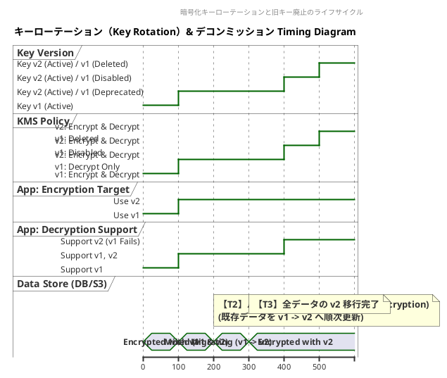
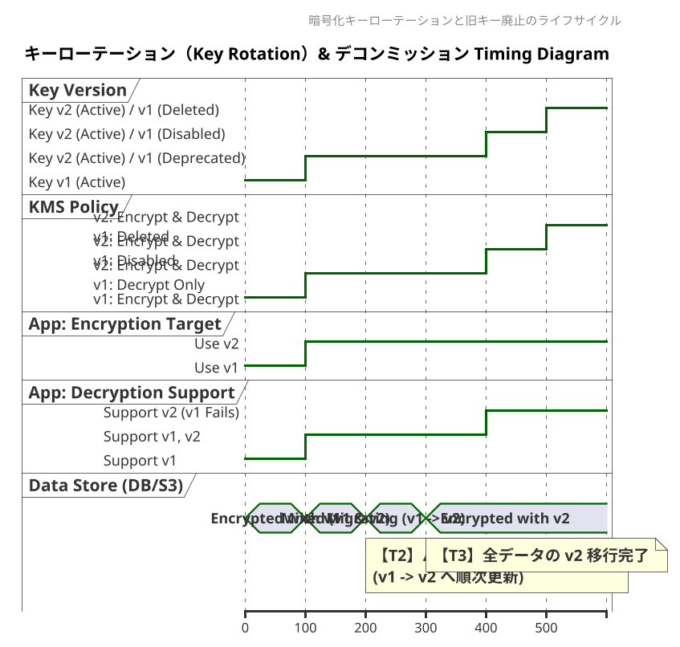

# Q1 webサービス、クラウドサービスでTiming図が役立つ事例を１６個しめしてください。
A1 by gemini
Webサービスやクラウドサービスの設計・開発・運用において、シーケンス図やタイムライン図などの「Timing図（タイミング図／時系列図）」は、非同期処理、状態遷移、並行処理、分散システムの挙動を可視化するために欠かせないツールです。

実務で Timing図 が特に威力を発揮する16の具体的事例をまとめました。

---

## 1. 認証・認可 (Authentication & Authorization)

* **1. OAuth 2.0 / OIDC (OpenID Connect) 認可コードフロー**
* ユーザー、ブラウザ、クライアント（Webアプリ）、認可サーバー、リソースサーバー間のリダイレクトとトークン発行のタイミングを整理する。


* **2. JWT（JSON Web Token）の更新とセッション管理**
* Access Tokenの失効（Expiration）、Refresh Tokenによる自動更新、サイレントリフレッシュのタイミングとレースコンディション（同時リクエスト時の旧トークン無効化）を制御する。


* **3. 多要素認証 (MFA) & Passkey（WebAuthn）登録・認証フロー**
* チャレンジコードの発行、ユーザー操作（デバイスの生体認証）、検証サーバーとの通信タイムアウト（TTL）の関係を視覚化する。


---

## 2. マイクロサービス・分散システム (Distributed Systems)

* **4. Sagaパターン（分散トランザクション）と補償処理**
* 複数サービスにまたがる処理（例: 注文 → 在庫引き当て → 決済）で、途中で失敗が発生した際の「逆順のロールバック（補償トランザクション）」のタイミングを定義する。


* **5. API Gateway と レート制限（Rate Limiting）**
* トークンバケットやリーキーバケットアルゴリズムにおいて、時間経過によるトークン補充とリクエスト消費、超過時の `429 Too Many Requests` 返却タイミングを示す。


* **6. イベント駆動型アーキテクチャ（Pub/Sub）とメッセージ順序保証**
* メッセージブローカー（Kafka, SQS等）を介した非同期通知で、イベント発生・配信・消費のタイムラグや、順序（FIFO）が崩れた際の処理ロジックを整理する。


---

## 3. 非同期処理・バックグラウンドジョブ (Async Processing)

* **7. 重い処理の非同期ポーリング / Webhook 通知**
* 動画エンコードやPDF生成時、クライアントがジョブを投入後、ステータス確認（Polling）や完了時の通知（Webhook）を行うレスポンスタイムラインを描く。


* **8. べき乗性（Idempotency）キーと重複防止処理**
* 同一の決済リクエストなどが通信エラーでリトライされた際、DBロックやキャッシュを参照して二重実行を防ぐデッドロック/レース条件を管理する。


---

## 4. 決済・EC・リアルタイム通信 (Payments & Real-time)

* **9. 外部決済ゲートウェイ（Stripe, PayPal等）の決済連携**
* ユーザーの画面遷移、バックエンドでの仮売上（Authorize）、外部APIからのWebhook受信による本売上（Capture）の順序とタイミングを明確化する。


* **10. リアルタイム通信（WebSocket / Server-Sent Events）**
* ハンドシェイク、双方向データ送信、Keep-Alive（Heartbeat/Ping-Pong）、接続断絶時の再接続（Backoff）の制御手順を可視化する。


* **11. オンライン予約・チケット確保（期間限定ロック）**
* 座席確保から「10分間キープ」、決済完了による確定、タイムアウトによる自動解放（TTL満了）のタイマー制御を追う。


---

## 5. キャッシュ・パフォーマンス最適化 (Caching & Edge)

* **12. CDN / Edge キャッシュの更新と Stale-While-Revalidate**
* オリジンサーバーへのリクエスト判定、キャッシュのTTL切れ、バックグラウンドでのキャッシュ再生成（Revalidate）と古いコンテンツの返却タイミングを示す。


* **13. キャッシュスタンプード（Thundering Herd）対策**
* 大量アクセス時にキャッシュが切れた瞬間、同時に多数のDBリクエストが飛ぶのを防ぐ（ロック獲得〜キャッシュ書き込み〜後続リクエストのキャッシュ参照）タイムラインを設計する。


---

## 6. インフラ・DevOps・運用管理 (Infra & Reliability)

* **14. Zero-Downtime デプロイメント（ブルー/グリーン、カナリアデプロイ）**
* トラフィックを段階的に新系へ切り替える際の、DNS TTL、ヘルスチェック、新旧バージョンの接続切り替えタイミングを管理する。


* **15. サーキットブレーカー（Circuit Breaker）パターン**
* 外部サービス故障時に「Closed（正常）→ Open（遮断）→ Half-Open（試行）」と状態が遷移する時間経過とリトライ判定を定義する。


* **16. 分散ロック（Redlock, ZooKeeper等）とLease（賃貸時間）管理**
* 複数インスタンスで排他制御を行う際、ロック取得・処理実行・ハートビートによる延長・TTL切れによる強制解放の競合を回避する。

# Q2 セキュリティとタイミング図の例を１６個しめしてください。
A2 セキュリティ領域において、Timing図（タイミング図／シーケンス図／タイムライン図）は「攻撃手法のメカニズム解明」**や**「堅牢な防御プロトコルの設計」**、そして**「時間軸が絡むセキュリティ実装」を理解・検証するために不可欠です。

Webサービス、クラウド、OS、ネットワークなどのセキュリティで Timing図が非常に役立つ具体例を16個紹介します。

---

## 1. 脆弱性・攻撃手法のメカニズム解析（Attacks & Exploits）

* **1. TOCTOU（Time-of-Check to Time-of-Use）レースコンディション**
* 権限やファイルの存在チェック（Check）を行ってから実際に処理を実行する（Use）までの僅かな隙間に、攻撃者がファイルや状態を差し替える攻撃のタイムラインを解明する。


* **2. セッション固定攻撃（Session Fixation）**
* ログイン前に攻撃者が用意したセッションIDを被害者に踏ませ、ログイン後もそのセッションIDが継続して使用されるタイミングを可視化し、ログイン時のセッションID再生成の必要性を示す。


* **3. タイムアウトに乗じたトークン奪取（Token Replay Attack）**
* ワンタイムパスワード（OTP）やJWTが有効期限（TTL）を迎える直前の応答遅延を狙い、ネットワーク上で奪取したトークンを再利用するタイトな攻撃シーケンスを図示する。


* **4. タイミング攻撃 / サイドチャネル攻撃（Timing Attacks）**
* パスワード検証や暗号処理において、一文字ごとの比較処理にかかる「処理時間の僅かなミリ秒差」を測定して秘密情報を復元する挙動をタイムラインで比較・検証する。


---

## 2. 認証・認可プロトコル（Authentication & Identity）

* **5. OAuth 2.0 StateパラメータによるCSRF防止**
* 認可リクエスト発行時に生成した `state` トークンと、リダイレクトバック時に検証するタイミングの一致を確認し、第三者による不正な連携（CSRF）を防ぐ流れを図解する。


* **6. 2要素認証（2FA/TOTP）のタイムウィンドウ許容**
* 30秒ごとに変化するワンタイムコード（TOTP）において、時刻ズレ（Clock Skew）を考慮した「前後1〜2ウィンドウの検証ロジック」と有効期限切れの境界線を示す。


* **7. FIDO2 / Passkey（WebAuthn）の検証シーケンス**
* ブラウザから発行されるチャレンジコード、Authenticator（生体認証デバイス）の署名、RP（Relying Party）サーバーでのタイムアウト付き検証の時系列を明確化する。


* **8. JWTのサイレントリフレッシュとRevocation（失効）**
* 短寿命なAccess Tokenの自動更新中に、管理者がアカウントを停止（Token Revocation）した場合、ブラックリスト参照やToken更新拒否がどのタイミングで反映されるかを整理する。


---

## 3. 通信・ネットワークセキュリティ（Network Security）

* **9. TLS 1.3 ハンドシェイクと 0-RTT（Early Data）リプレイ攻撃**
* TLS 1.3で導入された高速接続（0-RTT）において、事前共有鍵で暗号化されたデータが攻撃者にキャプチャされ、そのまま再送信（リプレイ）されるリスクと防御のタイミングを描く。


* **10. TCP SYN Flood 攻撃と SYN Cookies による防御**
* 大量のSYNパケットによりサーバーの接続待ちキュー（SYN Queue）が溢れる現象と、SYN Cookieを用いてステートレスにACKを検証・接続確立するタイミングの切り替えを示す。


* **11. Mutual TLS (mTLS) における証明書失効検証（OCSP Stapling）**
* クライアント・サーバー双方向認証時に、証明書失効リスト（CRL/OCSP）をリアルタイム検証するタイムラグを抑えるため、サーバーが事前にOCSP応答を「ホチキス留め（Staple）」して渡す時間軸を示す。


---

## 4. クラウド・アクセス制御（Cloud & Access Control）

* **12. AWS IAM 一時的クレデンシャル（STS Token）のライフサイクル**
* AssumeRoleによって発行される一時クレデンシャル（有効期限15分〜12時間）の取得、利用、および期限切れに伴う自動再取得（Token Rotation）のタイミングを設計する。


* **13. ゼロトラストにおける Continuous Adaptive Trust（継続的評価）**
* 一度ログインした後も、アクセス中に「デバイスのコンプライアンス状態変更」や「危険なIPからのアクセス」が発生した瞬間に、即座にセッションを切断・再認証要求する継続的評価を描く。


* **14. 分散環境でのレイヤー別レート制限とIP打ち切り（Rate Limiting & Banning）**
* DDoSやブルートフォース攻撃に対し、WAF/CDN層、API Gateway層、アプリ層でそれぞれ「○秒間に○回失敗したら○分間IPをブロックする」条件のタイムラインを揃える。


---

## 5. データ保護・運用セキュリティ（Data Protection & Ops）

* **15. 暗号化キーのローテーション（Key Rotation）と旧キーの廃止**
* KMS（キー管理サービス）で暗号化キーを自動更新する際、新キーでの暗号化開始、旧キーでの復号許可期間、最終的な旧キーの完全破棄（Re-encryption）までのタイムラインを管理する。


* **16. Webhookの署名検証（Timestamp & Signature）**
* 外部サービスから送信されるWebhook通知に対し、リクエストヘッダーに含まれるタイムスタンプ（例: `5分以上古いリクエストは棄却`）と署名を検証して、中間者攻撃やリプレイ攻撃を防ぐ処理順序を示す。

# Q3 暗号化キーのローテーション（Key Rotation）と旧キーの廃止 のTiming図をPlantUMLで書いてください。
A3
暗号化キーのローテーション（Key Rotation）と旧キーの再暗号化・廃止プロセスを表現したPlantUMLのTiming図（タイミング図）を作成しました。

### PlantUMLコード




---

### この図のポイント・解説

1. **フェーズ1: 通常運用（`T0`〜`T100`）**
* **Key v1** がアクティブであり、新規データの暗号化および既存データの復号の両方に使用されます。


2. **フェーズ2: ローテーション（`T100`〜`T200`）**
* **Key v2** が新たに発行され、アクティブキーになります。
* アプリの書き込み（新規暗号化）は **v2** に即座に切り替わります。
* KMSポリシーでは **v1** を「復号専用（Decrypt Only）」に格下げし、古いデータの読み取りを可能に保ちます。


3. **フェーズ3: データ再暗号化（`T200`〜`T300`）**
* バックグラウンド処理で、DBやオブジェクトストレージ内の **v1** で暗号化されたデータを **v2** で再暗号化（Re-encrypt）していきます。


4. **フェーズ4: 旧キー無効化（Disable）（`T400`）**
* 全データの **v2** 移行完了を確認後、**v1** を即座に削除せず「無効化（Disabled）」にします。
* 万が一、**v1** で暗号化された未移行データが残っていた場合に検出・対応するための安全期間（クーリング期間）です。


5. **フェーズ5: 旧キー削除（Delete）（`T500`）**
* 猶予期間が過ぎた後、**v1** をKMSから完全に消去します。これにより、セキュリティリスク（漏洩リスク）を完全に排除します。

# q2 上記図をweb版のpLANTUMLで表示すると、下記のように文字がかさなってしまいました。解消する方法はありませんか。
https://github.com/nagoyakaizen-star/uml/Day13/Timing.md at main · nagoyakaizen-star/uml
A2
Web版のPlantUMLビューア（PlantUML ServerやSVG描画エンジン）では、Timing図（タイミング図）の `note top of` や長いテキスト注釈の高さ・幅の自動計算が上手く機能せず、**文字やグラフィックが重なって表示される問題**がよく発生します。

この文字化け・重なりを解消するための【推奨修正コード】**と、レイアウトを安定させる**3つのテクニックを紹介します。

---

### 解消済みコード

`\n` による適度な改行と、注釈の向き（`note bottom` への一部変更）、および `scale` 指定を追加して、テキストが重ならないように最適化しました。




---

### 重なりを防ぐ3つのテクニック

#### 1. Note の幅を抑えて「改行 (`\n`)」を意識的に入れる

Webレイアウトエンジンは、1行が長い文字列の横幅計算に失敗しやすいため、以下のように **1行あたり10〜15文字程度で細かく改行する** のが最も効果的です。

* **NG (重なりやすい):**
`note top of KV : 【T1】キーローテーション実行 (新規キー v2 発行)`
* **OK (安定する):**
```plantuml
note top of KV
  【T1】キーローテーション実行
  (新規キー v2 発行)
end note

```


#### 2. `top` と `bottom` を分散させる

特定の行（一番上の要素など）に `note top of` が集中すると、上部の余白を突き抜けてタイトルや他のノートと重なります。

* 一番上の要素（`KV` など）には `note top`
* 一番下の要素（`DS` など）には **`note bottom`**

と指定することで、キャンバスの上下空間を有効活用できます。

#### 3. `scale 1.5` で全体を描画拡張する

コードの先頭付近に `scale 1.5` や `scale 1200 width` などを記載すると、要素同士の余白（パディング）が強制的に広がるため、文字の被りを物理的に防ぐことができます。

# Q1 この事例の対策として、HAZOPの１１のGuideワードに基づいて、それぞれのガイドワードごとに３つ以上、原因または対策をたててください。
A1 
**暗号化キーのローテーション（Key Rotation）および旧キーの廃止・再暗号化プロセス**に対して、システム/ソフトウェア向けHAZOP（Hazard and Operability Study）の代表的な**11のガイドワード**（基本7語 ＋ 時間/順序4語）を適用したリスク分析および対策案です。

各ガイドワードごとに「発生し得る原因」または「具体的な予防・軽減対策」を3つずつ定義しています。

---

## 1. NO / NOT（否定・不発生）

**設計意図:** キーの自動生成・ローテーション・再暗号化が意図通り実行されること。

* **原因1:** KMS（キー管理サービス）のIAM権限設定ミスにより、ローテーション実行用のWorkerがキー生成APIを呼び出せない。
* **対策1:** KMS操作用のサービスアカウント権限をIaC（Terraform等）でコード化し、CI/CDラインで事前検証（Dry-run）を実施する。
* **対策2:** ローテーション実行ジョブが失敗した場合、即座にSRE/運用チームへ通知するDLQ（Dead Letter Queue）およびアラートを設定する。
* **対策3:** 旧キー（v1）から新キー（v2）への再暗号化ジョブにおいて、対象データの抽出クエリがタイムアウトした際の自動リトライメカニズムを実装する。

---

## 2. MORE（過剰・量的増加）

**設計意図:** 定められた周期・数でキーが生成・保持・更新されること。

* **原因1:** 自動更新スクリプトの無限ループや二重起動により、短時間に多数のキーバージョン（v2, v3, v4...）が大量生成される。
* **対策1:** KMSの API 呼び出しにレートリミットを設け、1日に生成できるキーバージョンの上限数をハードコーディングで制限する。
* **対策2:** 短期間で複数のキーバージョンが発行された場合、キー生成を一時凍結して管理者に警告する異常検知ルールを構築する。
* **対策3:** データベースの再暗号化処理（v1→v2）において、並行ワーカー数が多すぎてDBのCPU/I/Oリソースを圧迫しないよう、セマフォによる並列度制御を行う。

---

## 3. LESS（不足・量的減少）

**設計意図:** 暗号化に必要なデータやキーの保持期間・アクセスが十分に維持されること。

* **原因1:** 旧キー（v1）の無効化（Disable）や削除（Delete）の猶予期間が短すぎて、未移行データが存在する状態で鍵が消滅する。
* **対策1:** KMSポリシーで削除スケジュールの最短待機期間（例: 最小7日〜30日間）を強制適用し、即時削除APIをブロックする。
* **対策2:** 旧キーの無効化（Disable）後、最低でも1つのバックアップ更新サイクルが経過するまで完全削除（Delete）を許可しないワークフローにする。
* **対策3:** 旧キー（v1）のアクセスログ（KMS Decryptログ）を監視し、過去30日間のアクセス回数が「ゼロ」であることを確認しないと削除ステップへ進めないガバナンスチェックを組み込む。

---

## 4. AS WELL AS（付加・異物混入）

**設計意図:** 規定の暗号化データとキーメタデータのみが正しく処理されること。

* **原因1:** キーバリューの切り替え時、新キー（v2）での暗号化と同時に不要なログや平文のデバッグ情報がストレージへ記録される。
* **対策1:** 暗号化処理の前後でメモリ上の平文データを明示的にゼロ消去（Zeroize）し、ログ出力フィルターでシークレット情報をマスクする。
* **対策2:** 暗号化データ構造体（Envelope）にキーIDやバージョン情報だけでなく、HMAC等の改ざん検知用タグを付加してデータの整合性を保証する。
* **対策3:** 暗号化処理を行うPOD/コンテナのメモリダンプが発生した際、平文キーがダンプファイルに含まれないようロック機能（`mlock`等）を適用する。

---

## 5. PART OF（不完全・一部欠損）

**設計意図:** 該当するすべての対象データが例外なく新キーで再暗号化されること。

* **原因1:** データベースのスキーマ変更やテーブルの分割により、一部の古いテーブル内のデータが再暗号化バッチの対象から漏れる。
* **対策1:** データベースのメタデータ（データディクショナリ）を自動スキャンし、暗号化カラムの未移行レコード数を毎時カウントするダッシュボードを設置する。
* **対策2:** 再暗号化処理をレコード単位ではなくトランザクション（Chunk単位）で管理し、一部失敗時は該当Chunkのみをロールバックして未完了ステータスを追跡する。
* **対策3:** アプリケーション側で旧キー（v1）で暗号化されたデータを読み込んだ際、読み込み時に自動で新キー（v2）に再暗号化して書き戻す「Lazy Migration（遅延移行）」を併用する。

---

## 6. REVERSE（逆転・反対）

**設計意図:** キーは「v1 → v2」へと不可逆で一方向に更新され、正しい手順で処理されること。

* **原因1:** 旧バージョンのアプリがデプロイされたままであり、新キー（v2）で再暗号化されたデータを誤って旧キー（v1）で上書き暗号化してしまう。
* **対策1:** KMSのキーポリシーで、旧キー（v1）に対する `Encrypt`（暗号化）権限を完全に剥奪し、`Decrypt`（復号）専用の権限へ移行させる（【T1】のタイミング）。
* **対策2:** アプリのデプロイ順序を強制し、「新キー対応コードの全台デプロイ完了」をパイプラインの事前条件としてキーローテーションをキックする。
* **対策3:** データストレージ側で、暗号化メタデータのバージョン番号が小さくなる（デグレードする）更新リクエストを弾くValidationロジックを実装する。

---

## 7. OTHER THAN（異質・非意図的動作）

**設計意図:** ローテーション処理中に意図しない予期せぬ状態が発生しないこと。

* **原因1:** ローテーション処理中に、攻撃者によって偽のキーIDや改ざんされたKMSエンドポイントへリクエストが誘導される。
* **対策1:** KMSとの通信には相互TLS（mTLS）およびAWS/GCP等のクラウドプロバイダが提供するエンドポイント検証を必須化する。
* **対策2:** 暗号化鍵の変更操作（Create, Rotate, Disable, Delete）に対してマルチステークホルダー承認（2人以上の管理者の承認）を要求する。
* **対策3:** キーローテーション中にシステム障害（KMSの障害など）が発生した際、自動的にフォールバックせず「フェイルセキュア（アクセス拒否状態）」で全処理を安全に停止させる。

---

## 8. SOONER THAN（予定より早い）

**設計意図:** キーの自動生成や廃棄が、適切な定義済みスケジュールに従って行われること。

* **原因1:** KMSの設定誤りやクロック同期エラー（NTPの狂い）により、ローテーションサイクル（例: 90日ごと）より大幅に早く旧キーが廃棄されてしまう。
* **対策1:** キーの無効化（Disable）から完全削除（Delete）への移行は、タイマーだけでなく「データ移行完了フラグ」の手動/自動検証を必須条件とする。
* **対策2:** サーバー群の時刻同期状態（Chrony/NTP）を常時モニタリングし、時刻ドリフト（ズレ）が発生した場合は自動バッチの実行を一時保留する。
* **対策3:** キーの「廃止予約」が実行された際、実際の削除までに数日間の猶予（Cooldown Period）をKMSレベルで安全装置として設定する。

---

## 9. LATER THAN（予定より遅い）

**設計意図:** キー更新および再暗号化が定められた期限内に完了すること。

* **原因1:** データベースのレコード量が膨大で、再暗号化バッチ（v1→v2）の完了に予想以上の時間がかかり、旧キー（v1）の無効化予定日に間に合わない。
* **対策1:** 再暗号化の進捗率（%）と完了予測時間をリアルタイムで算出するメトリクスを収集し、スケジュール遅延時に自動でバッチの並列数を増やす。
* **対策2:** 旧キーの無効化（Disable）フェーズへ移行する前に、「未移行データ件数 == 0」を条件とするゲートチェックをパイプラインに組み込む。
* **対策3:** 大量データの再暗号化には、ストレージ全体の全書換を避ける「エンベロープ暗号化（データ鍵の再暗号化のみを行い、データ本体の再暗号化をスキップする）」を採用して処理時間を短縮する。

---

## 10. LONGER THAN（時間超過・処理が長すぎる）

**設計意図:** 復号・再暗号化処理が定常的なWebサービスの応答時間を阻害しないこと。

* **原因1:** 1リクエストの処理中で「旧キー（v1）での復号」と「新キー（v2）での再暗号化」を同期的に実行した結果、Web APIのレスポンスタイムが著しく悪化する。
* **対策1:** レスポンスパスでは旧キーによる「復号」のみを行い、新キーへの「再暗号化と保存」は非同期のバックグラウンドタスク（メッセージキュー経由）に切り離す。
* **対策2:** KMSへのアクセス頻度を減らすため、復号されたデータ鍵（Data Encryption Key）をメモリ上で安全に短時間キャッシュ（Cache with TTL）する。
* **対策3:** アプリケーション側のAPIタイムアウト値を、再暗号化処理による遅延を見越して一時的にチューニングし、タイムアウトエラーの多発を防ぐ。

---

## 11. SHORTER THAN（時間不足・処理が短すぎる）

**設計意図:** 暗号化キーの生成・検証およびデータ検証に十分な時間をかけること。

* **原因1:** 新キー（v2）の生成後、KMSのレプリケーション（マルチリージョン同期）が完了する前にアプリがv2での暗号化を開始してしまい、別リージョンで復号エラーが発生する。
* **対策1:** 新キー発行後、全リージョンへの鍵情報の同期（Propagation）完了を確認するヘルスチェック待ち時間（Wait Step）を意図的に設ける。
* **対策2:** 再暗号化完了の検証（Integrity Check）を簡略化しすぎず、全ブロックのチェックサム検証を確実に通してから旧キー無効化ステップへ移行させる。
* **対策3:** 新キー（v2）発行直後に canary（カナリア）リリースを行い、小規模なトラフィックで一定時間（例: 1時間）運用してエラー率が急増しないことを検証するテスト期間を確保する。

# Q3 原因をそれぞれ３つ、それに対する対策は１つから３つお願いします。なお、参考文献としてWiki意義のURLをそれぞれ３つつけてください。
A3
HAZOPの11のガイドワードに基づき、**「原因をそれぞれ3つ」**、それらに対する「対策を1〜3つ」の形で整理し直しました。

また、信頼性の高い技術情報源として、AWS、Microsoft（Azure）、Google Cloud、NIST（米国標準技術研究所）などのドキュメントから、暗号鍵管理やHAZOPに関連する**参考URL**を各セクションに3つずつ掲載しています。

---

## 1. NO / NOT（否定・不発生）

**設計意図:** キーの自動生成・ローテーション・再暗号化が意図通り実行されること。

### 原因

1. **権限不備:** KMS（キー管理サービス）のIAM権限設定ミスにより、ローテーション実行用のWorkerがキー生成APIを呼び出せない。
2. **ネットワーク遮断:** VPCエンドポイントの設定ミスやIP制限により、ローテーションWorkerからKMSへの通信が拒否される。
3. **ジョブ破棄:** タスクランナー（Cron/EventBridge等）のサイレントエラーにより、自動実行イベント自体が発火しない。

### 対策

* **対策1:** KMS操作用のサービスアカウント権限をIaC（Terraform等）でコード化し、CI/CDラインで事前検証（Dry-run）を実施する。
* **対策2:** ローテーション実行ジョブが失敗した場合、即座にSRE/運用チームへ通知するDLQ（Dead Letter Queue）およびアラートを設定する。

### 参考文献（URL）

* [AWS: KMS 認証とアクセス制御](https://www.google.com/search?q=https://docs.aws.amazon.com/ja_jp/kms/latest/developerguide/control-access-overview.html)
* [Google Cloud: Cloud KMS キーの自動ローテーション](https://www.google.com/search?q=https://cloud.google.com/kms/docs/rotate-key)
* [Microsoft Learn: Azure Key Vault Key Rotation の自動化](https://www.google.com/search?q=https://learn.microsoft.com/ja-jp/azure/key-vault/keys/how-to-automated-key-rotation)

---

## 2. MORE（過剰・量的増加）

**設計意図:** 定められた周期・数でキーが生成・保持・更新されること。

### 原因

1. **無限ループ:** 自動更新スクリプトのロジックバグにより、短時間に多数のキーバージョン（v2, v3, v4...）が大量生成される。
2. **重複イベント:** メッセージブローカーのリトライや二重トリガーにより、同一サイクルで複数のキー生成リクエストが発行される。
3. **過度な並列処理:** DB再暗号化処理のWorker数が多すぎて、KMSのAPIクォータ（上限）を超倒・枯渇させてしまう。

### 対策

* **対策1:** KMSの API 呼び出しにレートリミットを設け、1日に生成できるキーバージョンの上限数をハードコーディングで制限する。
* **対策2:** 再暗号化処理において、並行ワーカー数が多すぎてDBのCPU/I/Oリソースを圧迫しないよう、セマフォによる並列度制御を行う。

### 参考文献（URL）

* [AWS: KMS のリクエスト制限とクォータ](https://www.google.com/search?q=https://docs.aws.amazon.com/ja_jp/kms/latest/developerguide/requests-per-second-quotas.html)
* [NIST: SP 800-57 Part 1 Rev. 5 (Key Management Recommendation)](https://csrc.nist.gov/pubs/sp/800/57/pt1/r5/final)
* [Microsoft Learn: Azure Key Vault のスロットリングガイド](https://www.google.com/search?q=https://learn.microsoft.com/ja-jp/azure/key-vault/general/throttling-guidance)

---

## 3. LESS（不足・量的減少）

**設計意図:** 暗号化に必要なデータやキーの保持期間・アクセスが十分に維持されること。

### 原因

1. **設定誤り:** 旧キー（v1）の無効化や削除の猶予期間設定が短すぎて、未移行データが存在する状態で鍵が削除される。
2. **バックアップ漏れ:** 旧キーに対応する暗号化バックアップデータの保持期間チェックを怠り、復元不能なデータが発生する。
3. **アクセス制御不足:** 開発者がテスト用コマンドで本番のKMSキーを誤って「削除予約」してしまう。

### 対策

* **対策1:** KMSポリシーで削除スケジュールの最短待機期間（例: 7〜30日間）を強制適用し、即時削除APIをブロックする。
* **対策2:** 旧キー（v1）のアクセスログ（KMS Decryptログ）を監視し、過去30日間のアクセス回数が「ゼロ」であることを確認しないと削除ステップへ進めないガバナンスチェックを組み込む。

### 参考文献（URL）

* [AWS: AWS KMS キーの削除](https://docs.aws.amazon.com/ja_jp/kms/latest/developerguide/deleting-keys.html)
* [Google Cloud: 鍵の破棄と復元](https://www.google.com/search?q=https://cloud.google.com/kms/docs/destroy-restore-key-versions)
* [OWASP: Cryptographic Storage Cheat Sheet](https://cheatsheetseries.owasp.org/cheatsheets/Cryptographic_Storage_Cheat_Sheet.html)

---

## 4. AS WELL AS（付加・異物混入）

**設計意図:** 規定の暗号化データとキーメタデータのみが正しく処理されること。

### 原因

1. **ログ汚染:** キーローテーション処理のデバッグ時、平文データや内部トークンが不注意にアプリケーションログへ出力される。
2. **メタデータ混入:** データ構造体へ暗号化データを格納する際、想定外の未検証パラメータが同時に書き込まれる。
3. **メモリダンプ露出:** 暗号化処理を行うプロセスがクラッシュした際、メモリダンプ内に平文キーや中間鍵情報が残存する。

### 対策

* **対策1:** 暗号化処理の前後でメモリ上の平文データを明示的にゼロ消去（Zeroize）し、ログ出力フィルターでシークレット情報をマスクする。
* **対策2:** 暗号化データ構造体（Envelope）にキーIDやバージョン情報だけでなく、HMAC等の改ざん検知用タグを付加してデータの整合性を保証する。

### 参考文献（URL）

* [AWS: エンベロープ暗号化の概念](https://www.google.com/search?q=https://docs.aws.amazon.com/ja_jp/kms/latest/developerguide/concepts.html%23enveloping)
* [CISA: HAZOP Methodology Overview](https://www.cisa.gov/)
* [Microsoft Learn: .NET での暗号化メモリの保護](https://learn.microsoft.com/ja-jp/dotnet/standard/security/how-to-use-data-protection)

---

## 5. PART OF（不完全・一部欠損）

**設計意図:** 該当するすべての対象データが例外なく新キーで再暗号化されること。

### 原因

1. **対象漏れ:** DBのスキーマ変更やテーブル追加により、一部の古いテーブル内のデータが再暗号化バッチの検索条件から漏れる。
2. **バッチ途中でクラッシュ:** メモリ不足（OOM）等でバッチ処理が途中終了し、未処理のレコードが取り残される。
3. **遅延インデックス:** 検索インデックスの同期遅延により、古いデータの一部が再暗号化キューに正しく投入されない。

### 対策

* **対策1:** データベースのメタデータを自動スキャンし、暗号化カラムの未移行レコード数を毎時カウントするダッシュボードを設置する。
* **対策2:** アプリケーション側で旧キー（v1）で暗号化されたデータを読み込んだ際、読み込み時に自動で新キー（v2）に再暗号化して書き戻す「Lazy Migration（遅延移行）」を併用する。

### 参考文献（URL）

* [Google Cloud: Cloud Storage での鍵の回転と再暗号化](https://cloud.google.com/storage/docs/encryption/customer-managed-keys)
* [MongoDB: Client-Side Field Level Encryption Automatic Key Rotation](https://www.mongodb.com/docs/manual/core/queryable-encryption/)
* [AWS: DynamoDB の暗号化キーローテーション](https://www.google.com/search?q=https://docs.aws.amazon.com/ja_jp/amazondynamodb/latest/developerguide/encryption.key-rotation.html)

---

## 6. REVERSE（逆転・反対）

**設計意図:** キーは「v1 → v2」へと不可逆で一方向に更新され、正しい手順で処理されること。

### 原因

1. **旧コードの生存:** ローリングアップデート中の旧バージョンアプリが、新キー（v2）で暗号化されたデータを誤って旧キー（v1）で書き戻してしまう。
2. **リカバリミス:** 障害発生時のデータベースリストア処理で、新キー移行前の古いバックアップデータを被せてしまい暗号化状態が先祖返りする。
3. **順序逆転:** アプリコードのデプロイ前にKMSのキー切り替えを先に行ってしまい、アプリが新キーを認識できず失敗する。

### 対策

* **対策1:** KMSのキーポリシーで、旧キー（v1）に対する `Encrypt`（暗号化）権限を完全に剥奪し、`Decrypt`（復号）専用の権限へ移行させる。
* **対策2:** アプリのデプロイ順序を強制し、「新キー対応コードの全台デプロイ完了」をパイプラインの事前条件としてキーローテーションをキックする。

### 参考文献（URL）

* [AWS: KMS キーポリシーでのアクセスコントロール](https://docs.aws.amazon.com/ja_jp/kms/latest/developerguide/key-policies.html)
* [Microsoft Learn: Azure App Service のゼロダウンタイムデプロイメント](https://learn.microsoft.com/ja-jp/azure/app-service/deploy-staging-slots)
* [HashiCorp Vault: Key Rotation Lifecycle](https://www.google.com/search?q=https://developer.hashicorp.com/vault/docs/concepts/key-rotation)

---

## 7. OTHER THAN（異質・非意図的動作）

**設計意図:** ローテーション処理中に意図しない予期せぬ状態が発生しないこと。

### 原因

1. **中間者攻撃 / 誘導:** 中間者攻撃（MITM）やDNSスプーフィングにより、不正なKMSエンドポイントへリクエストが誘導される。
2. **不正操作:** 悪意ある内部関係者や感染アカウントが、ローテーション手順に乗じて意図的にキー無効化コマンドを実行する。
3. **非対応の暗号アルゴリズム適用:** パッチ適用ミスにより、サポート対象外の暗号アルゴリズム（例: AES-128とAES-256の混同）でキーが更新される。

### 対策

* **対策1:** KMSとの通信には相互TLS（mTLS）およびクラウドプロバイダが提供するエンドポイント検証を必須化する。
* **対策2:** 暗号化鍵の変更操作（Create, Rotate, Disable, Delete）に対してマルチステークホルダー承認（2人以上の管理者の承認）を要求する。

### 参考文献（URL）

* [NIST: Cybersecurity Framework (CSF)](https://www.nist.gov/cyberframework)
* [AWS: VPC エンドポイント（AWS PrivateLink）経由での KMS アクセス](https://www.google.com/search?q=https://docs.aws.amazon.com/ja_jp/kms/latest/developerguide/kms-vpc-endpoints.html)
* [Google Cloud: Cloud KMS 職務分掌とIAM](https://www.google.com/search?q=https://cloud.google.com/kms/docs/separation-of-duties)

---

## 8. SOONER THAN（予定より早い）

**設計意図:** キーの自動生成や廃棄が、適切な定義済みスケジュールに従って行われること。

### 原因

1. **NTP時刻ズレ:** サーバー群のNTP時刻ズレにより、有効期限判定が「未来」に飛び、予定より早く旧キーが失効・破棄される。
2. **スクリプトの誤起動:** 開発者が手動実行したローテーションテストスクリプトが本番環境に向けて発火してしまう。
3. **タイマー誤設定:** ローテーション周期（例: 365日）の単位設定ミス（日と時間を誤認）で数日ごとに更新されてしまう。

### 対策

* **対策1:** サーバー群の時刻同期状態（Chrony/NTP）を常時モニタリングし、時刻ドリフト（ズレ）が発生した場合は自動バッチの実行を一時保留する。
* **対策2:** キーの「廃止予約」が実行された際、実際の削除までに数日間の猶予（Cooldown Period）をKMSレベルで安全装置として設定する。

### 参考文献（URL）

* [AWS: Time Sync Service での時刻同期](https://docs.aws.amazon.com/ja_jp/AWSEC2/latest/UserGuide/set-time.html)
* [Microsoft Learn: Windows サーバーでの時刻同期のトラブルシューティング](https://www.google.com/search?q=https://learn.microsoft.com/ja-jp/windows-server/networking/windows-time-service/troubleshoot-the-w32time-service)
* [Google Cloud: Cloud TrueTime と NTP](https://www.google.com/search?q=https://cloud.google.com/spanner/docs/truetime-external-consistency)

---

## 9. LATER THAN（予定より遅い）

**設計意図:** キー更新および再暗号化が定められた期限内に完了すること。

### 原因

1. **データ量肥大化:** データベースのレコード量が想定を超えて肥大化し、再暗号化バッチ（v1→v2）の完了が旧キー廃止日に間に合わない。
2. **リトライ地獄:** 不安定なネットワーク環境により一部レコードの再暗号化処理が何度も失敗し、全体スケジュールを遅延させる。
3. **ジョブのスタック:** デッドロックの発生により再暗号化ワーカーが停止（Hang）したまま検知されない。

### 対策

* **対策1:** 再暗号化の進捗率（%）と完了予測時間をリアルタイムで算出するメトリクスを収集し、スケジュール遅延時に自動でバッチの並列数を増やす。
* **対策2:** 大量データの再暗号化には、ストレージ全体の全書換を避ける「エンベロープ暗号化（データ鍵の再暗号化のみを行い、データ本体の再暗号化をスキップする）」を採用して処理時間を短縮する。

### 参考文献（URL）

* [AWS: KMS データキーキャッシュ（Data Key Caching）](https://www.google.com/search?q=https://docs.aws.amazon.com/ja_jp/kms/latest/developerguide/data-key-caching.html)
* [Google Cloud: Cloud KMS における大規模再暗号化設計](https://cloud.google.com/kms/docs/envelope-encryption)
* [Datadog: バッチ処理とジョブ遅延のモニタリング](https://docs.datadoghq.com/ja/monitors/)

---

## 10. LONGER THAN（時間超過・処理が長すぎる）

**設計意図:** 復号・再暗号化処理が定常的なWebサービスの応答時間を阻害しないこと。

### 原因

1. **同期処理の重圧:** APIのリクエストAPI内で「旧キーでの復号」と「新キーでの再暗号化」を同期実行し、Webレスポンスがタイムアウトする。
2. **KMSレイテンシ高騰:** ローテーション直後のアクセス集中により、KMS APIの応答速度が低下しアプリ全体が低速化する。
3. **ロック競合:** 再暗号化バッチがDBの行ロックを長時間保持するため、本番の書き込みトラフィックと競合・長時間待機が発生する。

### 対策

* **対策1:** レスポンスパスでは旧キーによる「復号」のみを行い、新キーへの「再暗号化と保存」は非同期のバックグラウンドタスク（メッセージキュー経由）に切り離す。
* **対策2:** KMSへのアクセス頻度を減らすため、復号されたデータ鍵（Data Encryption Key）をメモリ上で安全に短時間キャッシュ（Cache with TTL）する。

### 参考文献（URL）

* [AWS Encryption SDK: データキーキャッシュのベストプラクティス](https://docs.aws.amazon.com/ja_jp/encryption-sdk/latest/developer-guide/data-key-caching.html)
* [Microsoft Learn: 非同期メッセージングパターン（CQRS / Event-Driven）](https://learn.microsoft.com/ja-jp/azure/architecture/patterns/async-request-reply)
* [OWASP: Performance and Security Trade-offs](https://owasp.org/www-project-proactive-controls/)

---

## 11. SHORTER THAN（時間不足・処理が短すぎる）

**設計意図:** 暗号化キーの生成・検証およびデータ検証に十分な時間をかけること。

### 原因

1. **レプリケーション遅延:** 新キー（v2）の生成後、マルチリージョンKMSの鍵同期が完了する前にアプリがv2での暗号化を開始し、他リージョンで復号エラーになる。
2. **検証省略:** 再暗号化処理の完了チェックサム検証を「時間短縮のため」スキップし、壊れた暗号化データを見過ごす。
3. **カナリアテスト不足:** 新キー（v2）発行後、十分なカナリアリリース（一部トラフィックでの動作検証）を経ずに一括切り替えを行ってしまう。

### 対策

* **対策1:** 新キー発行後、全リージョンへの鍵情報の同期（Propagation）完了を確認するヘルスチェック待ち時間（Wait Step）を意図的に設ける。
* **対策2:** 新キー（v2）発行直後にカナリアリリースを行い、小規模なトラフィックで一定時間運用してエラー率が急増しないことを検証するテスト期間を確保する。

### 参考文献（URL）

* [AWS: マルチリージョン KMS キーのレプリケーション](https://docs.aws.amazon.com/ja_jp/kms/latest/developerguide/multi-region-keys-overview.html)
* [Google Cloud: グローバルインフラにおけるデータ整合性とレプリケーション](https://www.google.com/search?q=https://cloud.google.com/architecture/global-data-distribution-concepts)
* [Martin Fowler: CanaryRelease パターン](https://martinfowler.com/bliki/CanaryRelease.html)
