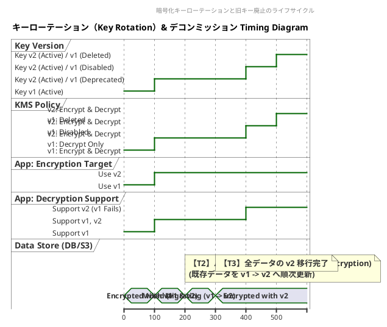
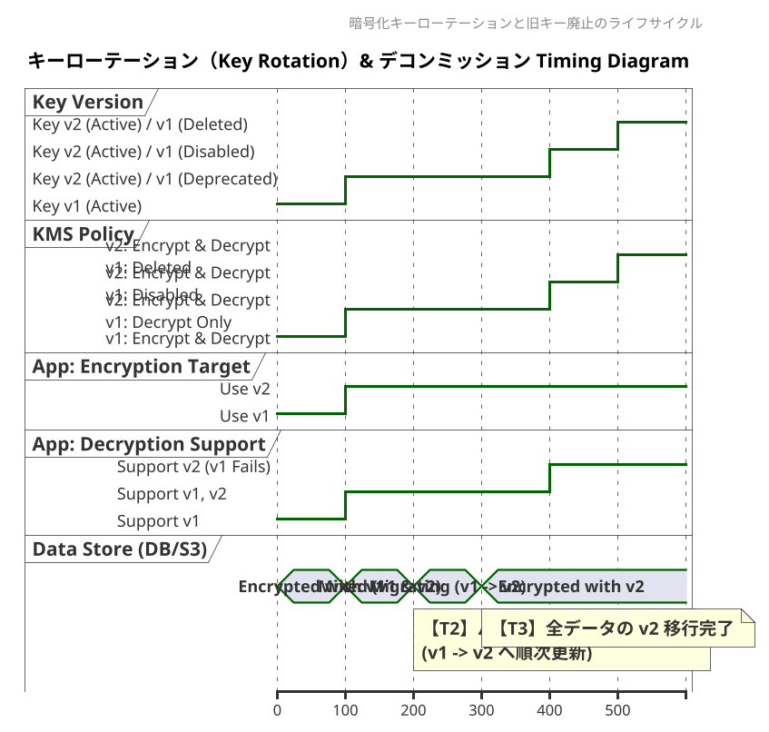

# Q1 webサービス、クラウドサービスでTiming図が役立つ事例を１６個しめしてください。
A1 by gemini
Webサービスやクラウドサービスの設計・開発・運用において、シーケンス図やタイムライン図などの「Timing図（タイミング図／時系列図）」は、非同期処理、状態遷移、並行処理、分散システムの挙動を可視化するために欠かせないツールです。

実務で Timing図 が特に威力を発揮する16の具体的事例をまとめました。

---

## 1. 認証・認可 (Authentication & Authorization)

* **1. OAuth 2.0 / OIDC (OpenID Connect) 認可コードフロー**
* ユーザー、ブラウザ、クライアント（Webアプリ）、認可サーバー、リソースサーバー間のリダイレクトとトークン発行のタイミングを整理する。


* **2. JWT（JSON Web Token）の更新とセッション管理**
* Access Tokenの失効（Expiration）、Refresh Tokenによる自動更新、サイレントリフレッシュのタイミングとレースコンディション（同時リクエスト時の旧トークン無効化）を制御する。


* **3. 多要素認証 (MFA) & Passkey（WebAuthn）登録・認証フロー**
* チャレンジコードの発行、ユーザー操作（デバイスの生体認証）、検証サーバーとの通信タイムアウト（TTL）の関係を視覚化する。


---

## 2. マイクロサービス・分散システム (Distributed Systems)

* **4. Sagaパターン（分散トランザクション）と補償処理**
* 複数サービスにまたがる処理（例: 注文 → 在庫引き当て → 決済）で、途中で失敗が発生した際の「逆順のロールバック（補償トランザクション）」のタイミングを定義する。


* **5. API Gateway と レート制限（Rate Limiting）**
* トークンバケットやリーキーバケットアルゴリズムにおいて、時間経過によるトークン補充とリクエスト消費、超過時の `429 Too Many Requests` 返却タイミングを示す。


* **6. イベント駆動型アーキテクチャ（Pub/Sub）とメッセージ順序保証**
* メッセージブローカー（Kafka, SQS等）を介した非同期通知で、イベント発生・配信・消費のタイムラグや、順序（FIFO）が崩れた際の処理ロジックを整理する。


---

## 3. 非同期処理・バックグラウンドジョブ (Async Processing)

* **7. 重い処理の非同期ポーリング / Webhook 通知**
* 動画エンコードやPDF生成時、クライアントがジョブを投入後、ステータス確認（Polling）や完了時の通知（Webhook）を行うレスポンスタイムラインを描く。


* **8. べき乗性（Idempotency）キーと重複防止処理**
* 同一の決済リクエストなどが通信エラーでリトライされた際、DBロックやキャッシュを参照して二重実行を防ぐデッドロック/レース条件を管理する。


---

## 4. 決済・EC・リアルタイム通信 (Payments & Real-time)

* **9. 外部決済ゲートウェイ（Stripe, PayPal等）の決済連携**
* ユーザーの画面遷移、バックエンドでの仮売上（Authorize）、外部APIからのWebhook受信による本売上（Capture）の順序とタイミングを明確化する。


* **10. リアルタイム通信（WebSocket / Server-Sent Events）**
* ハンドシェイク、双方向データ送信、Keep-Alive（Heartbeat/Ping-Pong）、接続断絶時の再接続（Backoff）の制御手順を可視化する。


* **11. オンライン予約・チケット確保（期間限定ロック）**
* 座席確保から「10分間キープ」、決済完了による確定、タイムアウトによる自動解放（TTL満了）のタイマー制御を追う。


---

## 5. キャッシュ・パフォーマンス最適化 (Caching & Edge)

* **12. CDN / Edge キャッシュの更新と Stale-While-Revalidate**
* オリジンサーバーへのリクエスト判定、キャッシュのTTL切れ、バックグラウンドでのキャッシュ再生成（Revalidate）と古いコンテンツの返却タイミングを示す。


* **13. キャッシュスタンプード（Thundering Herd）対策**
* 大量アクセス時にキャッシュが切れた瞬間、同時に多数のDBリクエストが飛ぶのを防ぐ（ロック獲得〜キャッシュ書き込み〜後続リクエストのキャッシュ参照）タイムラインを設計する。


---

## 6. インフラ・DevOps・運用管理 (Infra & Reliability)

* **14. Zero-Downtime デプロイメント（ブルー/グリーン、カナリアデプロイ）**
* トラフィックを段階的に新系へ切り替える際の、DNS TTL、ヘルスチェック、新旧バージョンの接続切り替えタイミングを管理する。


* **15. サーキットブレーカー（Circuit Breaker）パターン**
* 外部サービス故障時に「Closed（正常）→ Open（遮断）→ Half-Open（試行）」と状態が遷移する時間経過とリトライ判定を定義する。


* **16. 分散ロック（Redlock, ZooKeeper等）とLease（賃貸時間）管理**
* 複数インスタンスで排他制御を行う際、ロック取得・処理実行・ハートビートによる延長・TTL切れによる強制解放の競合を回避する。

# Q2 セキュリティとタイミング図の例を１６個しめしてください。
A2 セキュリティ領域において、Timing図（タイミング図／シーケンス図／タイムライン図）は「攻撃手法のメカニズム解明」**や**「堅牢な防御プロトコルの設計」**、そして**「時間軸が絡むセキュリティ実装」を理解・検証するために不可欠です。

Webサービス、クラウド、OS、ネットワークなどのセキュリティで Timing図が非常に役立つ具体例を16個紹介します。

---

## 1. 脆弱性・攻撃手法のメカニズム解析（Attacks & Exploits）

* **1. TOCTOU（Time-of-Check to Time-of-Use）レースコンディション**
* 権限やファイルの存在チェック（Check）を行ってから実際に処理を実行する（Use）までの僅かな隙間に、攻撃者がファイルや状態を差し替える攻撃のタイムラインを解明する。


* **2. セッション固定攻撃（Session Fixation）**
* ログイン前に攻撃者が用意したセッションIDを被害者に踏ませ、ログイン後もそのセッションIDが継続して使用されるタイミングを可視化し、ログイン時のセッションID再生成の必要性を示す。


* **3. タイムアウトに乗じたトークン奪取（Token Replay Attack）**
* ワンタイムパスワード（OTP）やJWTが有効期限（TTL）を迎える直前の応答遅延を狙い、ネットワーク上で奪取したトークンを再利用するタイトな攻撃シーケンスを図示する。


* **4. タイミング攻撃 / サイドチャネル攻撃（Timing Attacks）**
* パスワード検証や暗号処理において、一文字ごとの比較処理にかかる「処理時間の僅かなミリ秒差」を測定して秘密情報を復元する挙動をタイムラインで比較・検証する。


---

## 2. 認証・認可プロトコル（Authentication & Identity）

* **5. OAuth 2.0 StateパラメータによるCSRF防止**
* 認可リクエスト発行時に生成した `state` トークンと、リダイレクトバック時に検証するタイミングの一致を確認し、第三者による不正な連携（CSRF）を防ぐ流れを図解する。


* **6. 2要素認証（2FA/TOTP）のタイムウィンドウ許容**
* 30秒ごとに変化するワンタイムコード（TOTP）において、時刻ズレ（Clock Skew）を考慮した「前後1〜2ウィンドウの検証ロジック」と有効期限切れの境界線を示す。


* **7. FIDO2 / Passkey（WebAuthn）の検証シーケンス**
* ブラウザから発行されるチャレンジコード、Authenticator（生体認証デバイス）の署名、RP（Relying Party）サーバーでのタイムアウト付き検証の時系列を明確化する。


* **8. JWTのサイレントリフレッシュとRevocation（失効）**
* 短寿命なAccess Tokenの自動更新中に、管理者がアカウントを停止（Token Revocation）した場合、ブラックリスト参照やToken更新拒否がどのタイミングで反映されるかを整理する。


---

## 3. 通信・ネットワークセキュリティ（Network Security）

* **9. TLS 1.3 ハンドシェイクと 0-RTT（Early Data）リプレイ攻撃**
* TLS 1.3で導入された高速接続（0-RTT）において、事前共有鍵で暗号化されたデータが攻撃者にキャプチャされ、そのまま再送信（リプレイ）されるリスクと防御のタイミングを描く。


* **10. TCP SYN Flood 攻撃と SYN Cookies による防御**
* 大量のSYNパケットによりサーバーの接続待ちキュー（SYN Queue）が溢れる現象と、SYN Cookieを用いてステートレスにACKを検証・接続確立するタイミングの切り替えを示す。


* **11. Mutual TLS (mTLS) における証明書失効検証（OCSP Stapling）**
* クライアント・サーバー双方向認証時に、証明書失効リスト（CRL/OCSP）をリアルタイム検証するタイムラグを抑えるため、サーバーが事前にOCSP応答を「ホチキス留め（Staple）」して渡す時間軸を示す。


---

## 4. クラウド・アクセス制御（Cloud & Access Control）

* **12. AWS IAM 一時的クレデンシャル（STS Token）のライフサイクル**
* AssumeRoleによって発行される一時クレデンシャル（有効期限15分〜12時間）の取得、利用、および期限切れに伴う自動再取得（Token Rotation）のタイミングを設計する。


* **13. ゼロトラストにおける Continuous Adaptive Trust（継続的評価）**
* 一度ログインした後も、アクセス中に「デバイスのコンプライアンス状態変更」や「危険なIPからのアクセス」が発生した瞬間に、即座にセッションを切断・再認証要求する継続的評価を描く。


* **14. 分散環境でのレイヤー別レート制限とIP打ち切り（Rate Limiting & Banning）**
* DDoSやブルートフォース攻撃に対し、WAF/CDN層、API Gateway層、アプリ層でそれぞれ「○秒間に○回失敗したら○分間IPをブロックする」条件のタイムラインを揃える。


---

## 5. データ保護・運用セキュリティ（Data Protection & Ops）

* **15. 暗号化キーのローテーション（Key Rotation）と旧キーの廃止**
* KMS（キー管理サービス）で暗号化キーを自動更新する際、新キーでの暗号化開始、旧キーでの復号許可期間、最終的な旧キーの完全破棄（Re-encryption）までのタイムラインを管理する。


* **16. Webhookの署名検証（Timestamp & Signature）**
* 外部サービスから送信されるWebhook通知に対し、リクエストヘッダーに含まれるタイムスタンプ（例: `5分以上古いリクエストは棄却`）と署名を検証して、中間者攻撃やリプレイ攻撃を防ぐ処理順序を示す。

# Q3 暗号化キーのローテーション（Key Rotation）と旧キーの廃止 のTiming図をPlantUMLで書いてください。
A3
暗号化キーのローテーション（Key Rotation）と旧キーの再暗号化・廃止プロセスを表現したPlantUMLのTiming図（タイミング図）を作成しました。

### PlantUMLコード




---

### この図のポイント・解説

1. **フェーズ1: 通常運用（`T0`〜`T100`）**
* **Key v1** がアクティブであり、新規データの暗号化および既存データの復号の両方に使用されます。


2. **フェーズ2: ローテーション（`T100`〜`T200`）**
* **Key v2** が新たに発行され、アクティブキーになります。
* アプリの書き込み（新規暗号化）は **v2** に即座に切り替わります。
* KMSポリシーでは **v1** を「復号専用（Decrypt Only）」に格下げし、古いデータの読み取りを可能に保ちます。


3. **フェーズ3: データ再暗号化（`T200`〜`T300`）**
* バックグラウンド処理で、DBやオブジェクトストレージ内の **v1** で暗号化されたデータを **v2** で再暗号化（Re-encrypt）していきます。


4. **フェーズ4: 旧キー無効化（Disable）（`T400`）**
* 全データの **v2** 移行完了を確認後、**v1** を即座に削除せず「無効化（Disabled）」にします。
* 万が一、**v1** で暗号化された未移行データが残っていた場合に検出・対応するための安全期間（クーリング期間）です。


5. **フェーズ5: 旧キー削除（Delete）（`T500`）**
* 猶予期間が過ぎた後、**v1** をKMSから完全に消去します。これにより、セキュリティリスク（漏洩リスク）を完全に排除します。

# q2 上記図をweb版のpLANTUMLで表示すると、下記のように文字がかさなってしまいました。解消する方法はありませんか。
https://github.com/nagoyakaizen-star/uml/Day13/Timing.md at main · nagoyakaizen-star/uml
A2
Web版のPlantUMLビューア（PlantUML ServerやSVG描画エンジン）では、Timing図（タイミング図）の `note top of` や長いテキスト注釈の高さ・幅の自動計算が上手く機能せず、**文字やグラフィックが重なって表示される問題**がよく発生します。

この文字化け・重なりを解消するための【推奨修正コード】**と、レイアウトを安定させる**3つのテクニックを紹介します。

---

### 解消済みコード

`\n` による適度な改行と、注釈の向き（`note bottom` への一部変更）、および `scale` 指定を追加して、テキストが重ならないように最適化しました。




---

### 重なりを防ぐ3つのテクニック

#### 1. Note の幅を抑えて「改行 (`\n`)」を意識的に入れる

Webレイアウトエンジンは、1行が長い文字列の横幅計算に失敗しやすいため、以下のように **1行あたり10〜15文字程度で細かく改行する** のが最も効果的です。

* **NG (重なりやすい):**
`note top of KV : 【T1】キーローテーション実行 (新規キー v2 発行)`
* **OK (安定する):**
```plantuml
note top of KV
  【T1】キーローテーション実行
  (新規キー v2 発行)
end note

```


#### 2. `top` と `bottom` を分散させる

特定の行（一番上の要素など）に `note top of` が集中すると、上部の余白を突き抜けてタイトルや他のノートと重なります。

* 一番上の要素（`KV` など）には `note top`
* 一番下の要素（`DS` など）には **`note bottom`**

と指定することで、キャンバスの上下空間を有効活用できます。

#### 3. `scale 1.5` で全体を描画拡張する

コードの先頭付近に `scale 1.5` や `scale 1200 width` などを記載すると、要素同士の余白（パディング）が強制的に広がるため、文字の被りを物理的に防ぐことができます。
