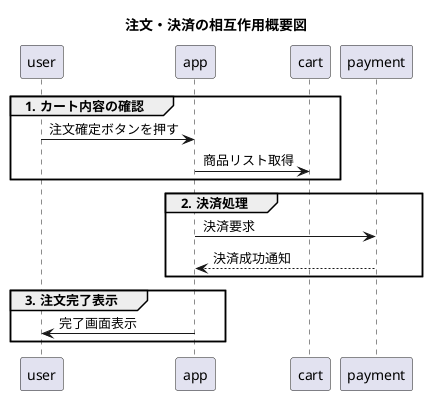
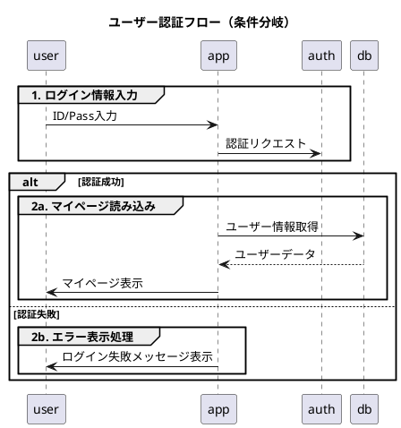
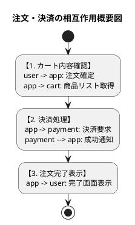

# Q1 相互作用概要図はPlantUMLでどう書くといいですか。例を３つ示してください。
A1 
相互作用概要図（Interaction Overview Diagram）は、UMLにおいて「全体の流れ（アクティビティ図）」の中に「各場面での相互作用（シーケンス図など）」を埋め込んだ図です。

PlantUMLでは、**アクティビティ図（`@startuml` 〜 `@enduml`）の記法をベースとし、アクションノード内を二重の中括弧 `{{ ... }}` で囲んでシーケンス図を埋め込む**ことで綺麗に表現できます。

実用的な3つの例（基本、条件分岐付き、並行処理付き）を紹介します。

---

## 1. 基本例：ECサイトの注文・決済フロー

最も標準的なパターンです。全体の処理フローの中に、各ステップのシーケンス図を埋め込みます。

```plantuml
@startuml
title 注文・決済の相互作用概要図

start

:カート内容の確認;
{{
  user -> app: 注文確定ボタンを押す
  app -> cart: 商品リスト取得
}}

:決済処理;
{{
  app -> payment: 決済要求
  payment --> app: 決済成功通知
}}

:注文完了表示;
{{
  app -> user: 完了画面表示
}}

stop
@enduml

```

```error
PlantUML version 1.2026.7beta10 / 227b91f [2026-07-22 15:48:19 UTC]
[From textarea (line 7) ]
 
@startuml
title 注文・決済の相互作用概要図
 
start
 
:カート内容の確認;
{{
 Syntax Error? (Assumed diagram type: activity.


---

## 2. 条件分岐（if/else）を含む例：ユーザーログイン認証

認証の成功・失敗によって次の相互作用（シーケンス図）を分岐させるパターンです。

```plantuml
@startuml
title ユーザー認証フロー（条件分岐）

start

:ログイン情報入力;
{{
  user -> app: ID/Pass入力
  app -> auth: 認証リクエスト
}}

if (認証成功?) then (yes)
  :マイページ読み込み;
  {{
    app -> db: ユーザー情報取得
    db --> app: ユーザーデータ
    app -> user: マイページ表示
  }}
else (no)
  :エラー表示処理;
  {{
    app -> user: ログイン失敗メッセージ表示
  }}
endif

stop
@enduml

```
```txt
PlantUML version 1.2026.7beta10 / 227b91f [2026-07-22 15:48:19 UTC]
[From textarea (line 7) ]
 
@startuml
title ユーザー認証フロー（条件分岐）
 
start
 
:ログイン情報入力;
{{
 Syntax Error? (Assumed diagram type: activity
---

## 3. 並行処理（fork/join）を含む例：注文確定後のバックエンド処理

複数の相互作用が同時に並行して実行される様子（発送準備とメール送信など）を表現するパターンです。

```plantuml
@startuml
title 注文確定後の並行処理

start

:注文受付;
{{
  user -> system: 注文手続き完了
}}

fork
  :在庫引き当て・発送準備;
  {{
    system -> warehouse: 発送指示データ送信
    warehouse -> db: 在庫数更新
  }}
fork again
  :確認メール送信;
  {{
    system -> mailer: メール送信要求
    mailer -> user: 注文完了メール到達
  }}
end fork

:処理完了通知;
{{
  system -> log: 処理ログ記録
}}

stop
@enduml

```
```txt
PlantUML version 1.2026.7beta10 / 227b91f [2026-07-22 15:48:19 UTC]
[From textarea (line 7) ]
 
@startuml
title 注文確定後の並行処理
 
start
 
:注文受付;
{{
 Syntax Error? (Assumed diagram type: activity)
---

## 書き方のポイント

1. **ベースはアクティビティ図（新記法）**
`start` / `stop` や `if ... then ... endif` などの最新のアクティビティ図記法を使用します。
2. **二重中括弧 `{{ ... }}` でシーケンス図を内包**
`:アクション名;` の代わりに `:タイトル;` と書いた上で `{{` と `}}` の間に通常の PlantUML シーケンス図コード（`A -> B: msg`）を書くだけで、自動的にサブダイアグラム枠（sd枠）としてレンダリングされます。

# Q2  Syntax Error? (Assumed diagram type: activity)というエラーがWeb版PlantUMLで出ます。どうなおしたらいいですか。
A2
WEB版PlantUMLで **`Syntax Error? (Assumed diagram type: activity)`** と表示される原因は、PlantUMLの構文解析器が「アクティビティ図（フローチャート）」として解釈しようとしたものの、二重中括弧 `{{ ... }}` の中に「シーケンス図（`user -> app` など）」が書かれているため構文エラーと判定しているからです。

残念ながら、**WEB版の標準PlantUMLサーバー（Graphviz構成）では、アクティビティ図の中に直接シーケンス図を入れ込む `{{ ... }}` 構文の動的レンダリングに対応していません**（ローカル環境＋特定のライブラリ構成でのみ動作する拡張構文のためです）。

---

## 修正方法（WEB版で動く代替案）

相互作用概要図（全体の流れ ＋ シーケンス）をWEB版で表現するには、以下の **2つのアプローチ** のいずれかに書き直す必要があります。

---

### 修正案1：シーケンス図の `group` / `frame` 機能を使う（推奨）

相互作用の「区切り（枠）」と「処理の流れ」を最もシンプルかつキレイに表現できる標準的な方法です。WEB版で100%動作します。

#### ① 基本例（注文・決済）



#### ② 条件分岐例（ログイン認証）

`alt` や `opt` を使うことで、条件分岐も1つの図の中に綺麗に表現できます。



---

### 修正案2：コンポーネント／アクティビティの中にテキストで記述する

フロー（矢印）の見た目を「アクティビティ図」に近づけたい場合は、ノードの中にテキストとしてやり取りを書き込む手法をとります。



---

## まとめ

WEB版PlantUMLで相互作用概要図を描く際は、**`{{ ... }}` を使わず「修正案1（シーケンス図の `group` 囲み）」を採用するのが最も可読性が高く、エラーの出ないベストな選択肢**になります。


