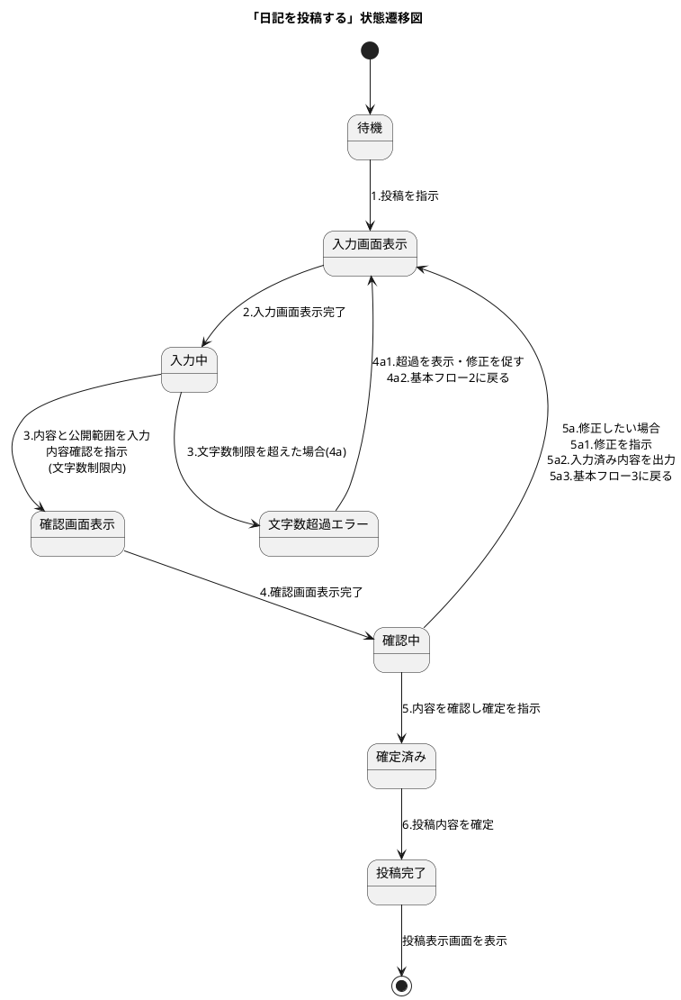
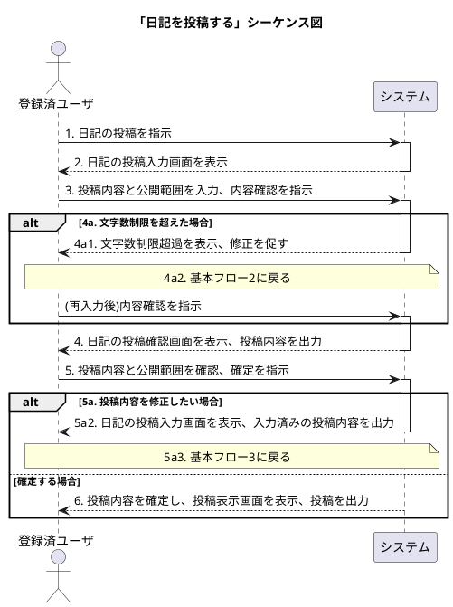
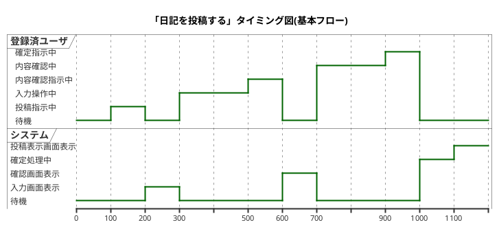
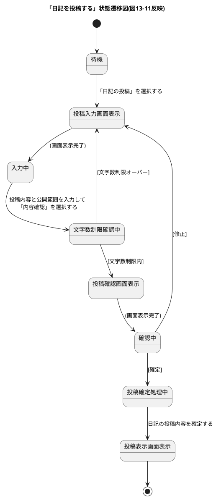
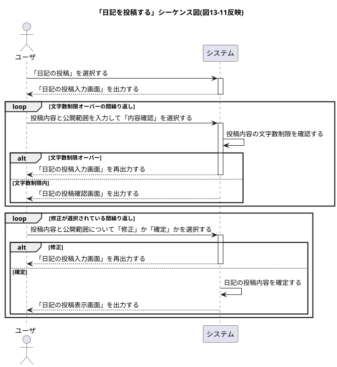
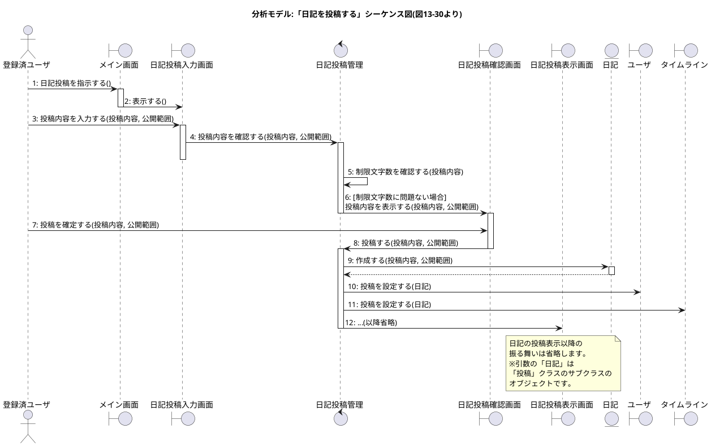

抽象データ型　ー＞　データ構造＋手続き：C++,JavaではClassという。

要求　ー＞　やりたいこと
　　　　　　自動でやってくれること

機能　ー＞　関数：ある入力に対して、出力が決まる。

非機能　＝＞　入力と出力以外のもの。
　　　　　　　ありとあらゆるものは出力に指定できる。
       　処理時間を出力にしたら、処理時間は機能

イベントフロー　ー＞　状態遷移図、シーケンス図、タイミング図
　その業種でよく使っている図を中心にし、そこから状態遷移、シーケンス、タイミングを自動生成できるとよい。
 
 、

分析　--> 設計と裏表
　設計なしに分析はできない。
　暗黙の設計を前提にしている。
 
設計：人が住む家（人の範囲、家の範囲、住む場所の範囲）

概念モデルは、Templateで描く。CLL、JAVA、RUST
　クラスは、具体的過ぎ・

 オブジェクト図　具体的なデータが入ったもの。型だけが決まってるのがクラス図、型も決まってないのがTemplate図

 コミュニケーション図は、シーケンス図に書き換えれる。時間の量が決まっている場合は、タイミング図。

 


# Q1 [uml/Day15/SNS.md at main · nagoyakaizen-star/uml](https://github.com/nagoyakaizen-star/uml/blob/main/Day15/SNS.md) にあるイベント表から、わかる範囲で、状態遷移図、シーケンス図、タイミング図をPlantUMLで記述してくだし。
A1 by claud


画像を確認しました。「表13-10:日記を投稿する」ユースケースのイベントフロー(基本フロー+代替フロー)から、状態遷移図・シーケンス図・タイミング図を作成します。

## 1. 状態遷移図

投稿処理全体を1つの状態機械として捉え、代替フロー(4a:文字数超過、5a:修正)もエラー/差し戻し遷移として表現しています。



## 2. シーケンス図

`alt`で代替フロー4a・5aの分岐を表現しています。



## 3. タイミング図

正常系(基本フロー1〜6)における、ユーザとシステムそれぞれの状態遷移タイミングを表しています。



**補足**
- 状態遷移図・シーケンス図には代替フロー(4a: 文字数制限超過、5a: 修正)を反映しましたが、タイミング図はPlantUMLの制約上、分岐表現が難しいため基本フロー(正常系)のみとしています。もし代替フローも別図として欲しい場合は追加で作成します。
- 実際の値(文字数制限の具体的な文字数、公開範囲の選択肢など)は表に記載がなかったため反映していません。追加情報があれば、より具体的な図に更新できます。


# Q2 参考までに、次の図も考慮して、更新してください。


A2
アクティビティ図(図13-11)を拝見しました。文字数制限チェックと「修正/確定」の分岐が、テキストのイベントフロー(4a・5a)よりも正確な位置・ラベルで描かれているので、それに合わせて3つの図を更新します。

## 1. 状態遷移図(更新版)



## 2. シーケンス図(更新版)



## 3. タイミング図(更新版)

分岐(ループ)を含む図なので、タイミング図は「文字数制限オーバーで1回差し戻された後、確定に至る」代表的な1本のシナリオとして表現しています。

```plantuml
@startuml diary_post_timing_v2
title 「日記を投稿する」タイミング図(図13-11反映・代表シナリオ)

robust "ユーザ" as User
robust "システム" as Sys

@0
User is 待機
Sys is 待機

@100
User is 投稿選択中

@200
User is 待機
Sys is 投稿入力画面出力

@300
User is 入力中(1回目)

@500
User is 内容確認選択中

@600
User is 待機
Sys is 文字数制限確認中

@700
Sys is 投稿入力画面再出力(オーバー)

@800
User is 入力中(2回目・修正)

@1000
User is 内容確認選択中

@1100
User is 待機
Sys is 文字数制限確認中

@1200
Sys is 投稿確認画面出力

@1300
User is 修正/確定選択中

@1500
User is 待機
Sys is 確定処理中

@1600
Sys is 投稿表示画面出力

@enduml
```

**更新のポイント**
- 「文字数制限確認」はテキストの代替フロー(4a)ではなく、**アクティビティ図では毎回必ず通る分岐処理**として描かれていたため、状態遷移図・シーケンス図とも通常フローの一部(loop/alt)に組み込みました。
- 「修正 or 確定」の分岐も同様に、確認画面表示後に必ず発生する分岐として表現しています。
- タイミング図は「1回文字数オーバーで差し戻された後に確定する」代表的な1シナリオのみを表しています。他のパターン(即確定、複数回の修正など)も見たい場合は追加で作成します。


# communication 


上記図から、シーケンス図と、できればタイミング図もPlantUMLで生成してください。

図13-30のコミュニケーション図を確認しました。番号(1〜12)とオブジェクト間の呼び出し関係を読み取り、シーケンス図とタイミング図に変換します。

**読み取りにあたっての前提(念のため確認させてください)**
- 5:「制限文字数を確認する(投稿内容)」は`:日記投稿管理`の自己呼び出し(自身の中で文字数チェックを行う処理)として解釈しました。
- 9:「作成する」で`:日記投稿管理`が`:日記`オブジェクトを新規生成し、10・11の「投稿を設定する(日記)」でその日記オブジェクトを`:ユーザ`と`:タイムライン`双方に紐付ける、という解釈にしています(図の注記どおり、引数は「投稿」クラスのサブクラス「日記」のオブジェクトです)。
- 12は「以降省略」なので、`:日記投稿表示画面`への遷移のみ簡略に表現しています。

もし5・10・11の向きが異なる場合は教えてください。それを踏まえて修正します。

## 1. シーケンス図



## 2. タイミング図

各オブジェクトが「アイドル/処理中」に切り替わるタイミングを、メッセージ番号1〜12の流れに沿って表しています。

```plantuml
@startuml diary_communication_timing
title 分析モデル:「日記を投稿する」タイミング図(図13-30より)

robust "登録済ユーザ" as User
robust "メイン画面" as Main
robust "日記投稿入力画面" as InputScreen
robust "日記投稿管理" as Manager
robust "日記投稿確認画面" as ConfirmScreen
robust "日記" as Diary
robust "ユーザ(日記保持)" as UserObj
robust "タイムライン" as Timeline
robust "日記投稿表示画面" as DisplayScreen

@0
User is アイドル
Main is アイドル
InputScreen is アイドル
Manager is アイドル
ConfirmScreen is アイドル
Diary is 未生成
UserObj is アイドル
Timeline is アイドル
DisplayScreen is アイドル

@100
User is 指示中(1)

@200
User is アイドル
Main is 表示処理中(2)

@300
Main is アイドル
InputScreen is 入力待ち

@400
User is 入力中(3)

@600
User is アイドル
InputScreen is 確認依頼中(4)

@700
InputScreen is アイドル
Manager is 文字数確認中(5)

@800
Manager is 確認画面表示中(6)
ConfirmScreen is 表示中

@900
User is 確定指示中(7)

@1000
User is アイドル
ConfirmScreen is 投稿依頼中(8)

@1100
ConfirmScreen is アイドル
Manager is 日記生成中(9)
Diary is 生成済み

@1200
Manager is 設定処理中(10,11)
UserObj is 設定済み
Timeline is 設定済み

@1300
Manager is 表示遷移中(12)
DisplayScreen is 表示中

@1400
Manager is アイドル

@enduml
```

**補足**
- コミュニケーション図には条件分岐(6の`[制限文字数に問題ない場合]`)以外の代替経路(文字数オーバー時の処理など)は描かれていなかったため、正常系のみを表現しています。
- 「9:作成する」で新規生成される`:日記`オブジェクトの生成タイミングを、シーケンス図では`activate`/`deactivate`、タイミング図では状態「未生成→生成済み」で表現しました。

# 事前条件（入力）、事後条件（出力）


## Q1 上記図から、CSP、Event-B, VDM, Uppaal, SPINなどの形式手法で事前条件、事後条件を記述してください。
5つの形式手法それぞれの特性(状態ベース vs プロセス代数 vs タイムドオートマトン vs モデル検査)に合わせて、事前条件・事後条件を記述します。分量が多いため、Markdownファイルにまとめます。

## 図から読み取ったモデル

- **事前条件**:`林田:ユーザ`(氏名・メールアドレス・パスワードを保持)が`:タイムライン`と直接関連付いている
- **事後条件**:新しい`:日記`エンティティ(作成日・投稿内容・公開範囲を保持)が生成され、`ユーザ`と`タイムライン`の間に挿入される形で両方とリンクする

この「ユーザが日記を投稿すると、日記オブジェクトが生成されユーザとタイムラインに関連付けられる」という状態遷移を、各形式手法で表現します。**要点**

- **VDM-SL / Event-B**は`pre`/`post`(またはガード/アクション)をネイティブに書けるため、これまでの状態遷移図・シーケンス図の入出力仕様をほぼそのまま厳密化できます。
- **CSP / Uppaal / SPIN**は状態遷移・プロセスベースの検証ツールのため、「事前条件=ガード」「事後条件=アサーションやトレース制約」という形で近似しています。特にUppaalは前回のタイミング図(文字数超過時の差し戻しループ等)とも相性が良く、SPINは競合状態の網羅的検証に強みがあります。

いずれの記述も、投稿内容の文字数制限(`MAXLEN`)と「日記が生成されユーザ・タイムライン双方に紐づく」という事後条件を軸に統一して書いています。特定の性質(例:同時投稿の排他制御、公開範囲による閲覧制御の検証など)を重点的に形式検証したい場合は、その部分を深掘りして拡張できます。

```
# 「日記を投稿する」の形式手法による事前条件・事後条件記述

対象:図13-33「事前条件と事後条件のシステムの状態(オブジェクト図)」

## モデルの前提

オブジェクト図から次のドメインモデルを抽出しました。

| 種別 | 内容 |
|---|---|
| エンティティ | `USER`(氏名・メールアドレス・パスワード)、`DIARY`(作成日・投稿内容・公開範囲)、`TIMELINE` |
| 事前条件 | `USER` は `TIMELINE` と直接関連している(`user_timeline: USER → TIMELINE`) |
| 事後条件 | 新規 `DIARY` インスタンス `d` が生成され、`author(d)=USER`、`d` が `USER` の `TIMELINE` に追加される |
| 制約 | 投稿内容の文字数は上限 `MAXLEN` 以内(前回までのイベントフローより) |

形式手法ごとに「事前条件/事後条件」を自然に書けるもの(VDM, Event-B)と、状態遷移・プロセスとして表現し、ガード条件やアサーションで代替するもの(CSP, Uppaal, SPIN)に分かれます。それぞれの流儀に沿って記述しています。

---

## 1. VDM-SL(最も直接的にpre/postを書ける)

```vdm
types
  UserId    = token;
  Content   = seq of char;
  Scope     = <Public> | <FriendsOnly> | <Private>;
  DateType  = nat;  -- 簡略化のためYYYYMMDD等の自然数とする

  Diary :: author      : UserId
           content     : Content
           scope       : Scope
           createdDate : DateType

  User :: name     : seq of char
          mail     : seq of char
          password : seq of char

values
  MAXLEN : nat = 500

state DiarySystem of
  users     : map UserId to User
  timelines : map UserId to set of Diary   -- ユーザごとのタイムライン
inv
  forall u in set dom users &
    u in set dom timelines
end

operations
  PostDiary (u : UserId, content : Content, scope : Scope, today : DateType) d : Diary
  ext rd users     : map UserId to User
      wr timelines : map UserId to set of Diary
  pre
    u in set dom users and
    len content <= MAXLEN
  post
    d.author = u and
    d.content = content and
    d.scope = scope and
    d.createdDate = today and
    timelines(u) = timelines~(u) union {d} and
    -- 他ユーザのタイムラインは不変
    (forall v in set dom timelines~ & v <> u =>
        timelines(v) = timelines~(v));
```

**ポイント**:`~`(チルダ)は操作実行前の値を参照するVDMの慣用記法です。事前条件は「ユーザが存在し、文字数制限内であること」、事後条件は「新しい日記が生成され、当該ユーザのタイムラインにのみ追加され、他ユーザの状態は変化しないこと(フレーム条件)」を明示しています。

---

## 2. Event-B(状態機械+不変条件+ガード付きイベント)

```
MACHINE DiaryPost
SETS
  USER, DIARY, TIMELINE, CONTENT, SCOPE, DATE
CONSTANTS
  MAXLEN, len, user_timeline
AXIOMS
  axm1: MAXLEN ∈ ℕ
  axm2: len ∈ CONTENT → ℕ
  axm3: user_timeline ∈ USER → TIMELINE   /* 各ユーザは1つのタイムラインを持つ(全域単射でなくてもよい) */

VARIABLES
  diary_set        /* 既存の日記の集合 */
  author            /* DIARY ⇸ USER */
  diary_content     /* DIARY ⇸ CONTENT */
  diary_scope       /* DIARY ⇸ SCOPE */
  diary_date        /* DIARY ⇸ DATE */
  timeline_diaries  /* TIMELINE ↔ DIARY */

INVARIANTS
  inv1: diary_set ⊆ DIARY
  inv2: author ∈ diary_set ⇸ USER
  inv3: diary_content ∈ diary_set ⇸ CONTENT
  inv4: diary_scope ∈ diary_set ⇸ SCOPE
  inv5: diary_date ∈ diary_set ⇸ DATE
  inv6: dom(author) = diary_set
  inv7: timeline_diaries ⊆ TIMELINE × diary_set
  inv8: ∀d· d ∈ diary_set ⇒
          (user_timeline(author(d)) ↦ d) ∈ timeline_diaries

EVENTS
  INITIALISATION
    THEN
      act1: diary_set := ∅
      act2: author := ∅
      act3: diary_content := ∅
      act4: diary_scope := ∅
      act5: diary_date := ∅
      act6: timeline_diaries := ∅
    END

  Event PostDiary
    ANY u, d, content, scope, today
    WHERE
      grd1: u ∈ USER
      grd2: d ∈ DIARY \ diary_set          /* 新規IDであること */
      grd3: content ∈ CONTENT
      grd4: scope ∈ SCOPE
      grd5: today ∈ DATE
      grd6: len(content) ≤ MAXLEN          /* 事前条件:文字数制限 */
    THEN
      act1: diary_set          := diary_set ∪ {d}
      act2: author(d)          := u
      act3: diary_content(d)   := content
      act4: diary_scope(d)     := scope
      act5: diary_date(d)      := today
      act6: timeline_diaries   := timeline_diaries ∪
                                   {user_timeline(u) ↦ d}
    END
END
```

**ポイント**:`WHERE`句のガード(grd1〜grd6)が事前条件、`THEN`句のアクション(act1〜act6)実行後に成立する状態が事後条件です。不変条件(inv1〜inv8)により「生成された日記は必ずタイムラインに紐づく」という整合性が常時保証されることを、証明義務(proof obligation)として検証できます。

---

## 3. CSP(プロセス代数:トレース/ガード付きイベントとして表現)

CSPには本来「状態のpre/post」という概念はなく、**イベントの発生条件(ガード)とトレース**で近似します。状態を伴う整合性検証をしたい場合は CSP‖B のように B/Event-B と組み合わせるのが一般的ですが、ここでは純粋なCSPMコードとして「投稿イベントが起こりうる条件」と「起きた後に許される振る舞い」を表現します。

```csp
-- CSPm (FDR用)
channel postDiary : USER.CONTENT.SCOPE
channel diaryCreated : USER.DIARY

MAXLEN = 500

-- 「事前条件」を満たすときのみ postDiary が selectable
-- (len(c) <= MAXLEN はガードとして表現)
DiarySystem(existingDiaries) =
  □ u : USER, c : CONTENT, s : SCOPE,
      length(c) <= MAXLEN &
        postDiary.u.c.s ->
          diaryCreated.u.(freshId(existingDiaries)) ->
            DiarySystem(existingDiaries ^ <(u,c,s)>)

-- 事後条件に相当する性質:
-- 「postDiary が受理された直後には必ず diaryCreated が続く」
POST_SPEC =
  □ u : USER, c : CONTENT, s : SCOPE &
    postDiary.u.c.s -> □ d : DIARY & diaryCreated.u.d -> POST_SPEC

-- 事前条件違反(文字数超過)は postDiary のアルファベットに現れない
-- (=システムはガード外のイベントを提供しない = refuse する)
assert DiarySystem(<>) [T= POST_SPEC
assert DiarySystem(<>) :[deadlock free [F]]
```

**ポイント**:「事前条件」はイベントが選択可能(offer される)ための**ガード**として、「事後条件」は「そのイベントの直後に何が必ず起きるか」という**トレース制約**として表現しています。`assert ... [T=` はトレース精密化によって仕様への適合を確認する検証項目です。

---

## 4. Uppaal(タイムドオートマトン:ロケーション+ガード+更新式)

Uppaalも状態遷移系なので、事前条件は**エッジのガード**、事後条件は**更新式(update)実行後にロケーション不変条件として成立する内容**で表現します。

```c
// 宣言部(Declarations)
const int MAXLEN = 500;
const int MAX_DIARY = 100;

typedef struct {
    int author;
    int contentLen;
    int scope;
    int createdDate;
} Diary;

Diary diaries[MAX_DIARY];
int diaryCount = 0;
int today = 0;

// PostDiaryオートマトンのテンプレート(パラメータ u, contentLen, scope)
// Locations: Idle -> Checking -> Posted -> Idle
```

```
// テンプレート: DiaryPoster(int u, int contentLen, int scope)
// エッジ 1: Idle -> Posted
//   Guard  (事前条件): contentLen <= MAXLEN && diaryCount < MAX_DIARY
//   Update (事後条件を成立させる代入):
//       diaries[diaryCount].author = u,
//       diaries[diaryCount].contentLen = contentLen,
//       diaries[diaryCount].scope = scope,
//       diaries[diaryCount].createdDate = today,
//       diaryCount++
//
// ロケーション Posted の不変条件(事後条件の一部として検証したい性質):
//   diaries[diaryCount-1].author == u
```

検証したい性質(TCTL)の例:

```
// 「文字数制限を超えた投稿は、いかなる経路でも Posted に到達しない」
A[] (forall (i : int[0, MAX_DIARY-1])
      diaries[i].contentLen <= MAXLEN)

// 「Idle にいるとき、いつか必ず Posted に到達できる可能性がある(生存性)」
E<> DiaryPoster.Posted
```

**ポイント**:Uppaalは時間制約を持つ検証(タイムアウト付きリトライ等、前回作成したタイミング図の内容)にも展開しやすいのが利点です。文字数制限オーバー時の「差し戻し」ループも `Checking -> Idle` エッジのガード `contentLen > MAXLEN` として自然に追加できます。

---

## 5. SPIN/Promela(モデル検査:プロセス+assert+LTL)

SPINでは事前条件は**ガード付き実行文(暗黙のブロッキング条件)**、事後条件は**`assert()`による表明**、システム全体としての性質は**LTL式**で検証します。

```promela
#define MAXLEN 500
#define MAXDIARY 10

typedef Diary {
    byte author;
    byte contentLen;
    byte scope;
    byte createdDate;
};

Diary diaries[MAXDIARY];
byte diaryCount = 0;
byte today = 1;
bool posted = false;

proctype PostDiary(byte u; byte contentLen; byte scope) {
    /* 事前条件: 文字数制限内、かつ格納領域に空きがあること */
    atomic {
        (contentLen <= MAXLEN) && (diaryCount < MAXDIARY) ->
            diaries[diaryCount].author = u;
            diaries[diaryCount].contentLen = contentLen;
            diaries[diaryCount].scope = scope;
            diaries[diaryCount].createdDate = today;
            diaryCount++;
            posted = true;

            /* 事後条件: 直前に追加した日記が正しく設定されていること */
            assert(diaries[diaryCount-1].author == u);
            assert(diaries[diaryCount-1].contentLen == contentLen);
    }
}

init {
    run PostDiary(1, 120, 0);   /* 例: ユーザ1が120文字の日記を公開範囲0で投稿 */
}

/* 検証したいLTL性質の例:
   「文字数制限を超えた投稿は、システムに反映されない(diaryCountが増えない)」*/
ltl safety {
    [] (diaryCount > 0 -> diaries[diaryCount-1].contentLen <= MAXLEN)
}
```

**ポイント**:`atomic { guard -> ... }` の `guard` 部分がブロックすることで「事前条件を満たさない限り実行できない」ことを表現し、`assert()` が「実行直後に必ず成立すべき事後条件」のチェックになります。SPINはこれを状態空間を網羅的に探索して検証します。

---

## まとめ:各形式手法の向き不向き

| 手法 | pre/postの書き方 | 得意なこと | この題材での主な用途 |
|---|---|---|---|
| **VDM-SL** | `pre`/`post`節がネイティブに存在 | データ変換の正しさの厳密証明 | 投稿処理の入出力仕様を数学的に定義 |
| **Event-B** | ガード(`WHERE`)/アクション(`THEN`)+不変条件 | 段階的詳細化・整合性の証明 | 「日記は必ずタイムラインに紐づく」等の不変条件の証明 |
| **CSP** | ガード付きイベント+トレース制約 | 並行・通信・デッドロック検証 | 複数ユーザが同時に投稿する際の競合/整合性検証 |
| **Uppaal** | エッジガード+更新式+TCTL | 時間制約付きの振る舞い検証 | 文字数超過時の差し戻しループ、タイムアウト処理の検証 |
| **SPIN/Promela** | ガード+`assert`+LTL | 有限状態空間の網羅的モデル検査 | 実装に近い擬似コードでのバグ探索(データ競合等) |

VDMとEvent-Bはこれまで作成した状態遷移図・シーケンス図の「入力→出力」を直接的に厳密化するのに向いており、CSP・Uppaal・SPINはむしろ「複数アクターが絡む並行性・タイミング・競合」を検証したい場合に真価を発揮します。もし特定の性質(例:「同時に2人が同じ日記を編集できない」等の排他制御)を重点的に検証したい場合は、その手法を深掘りして詳細化できます。


