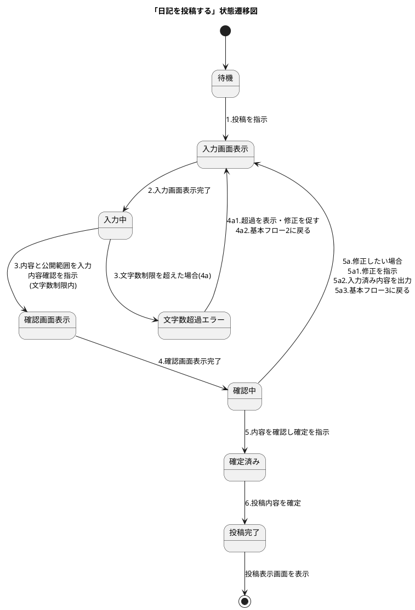
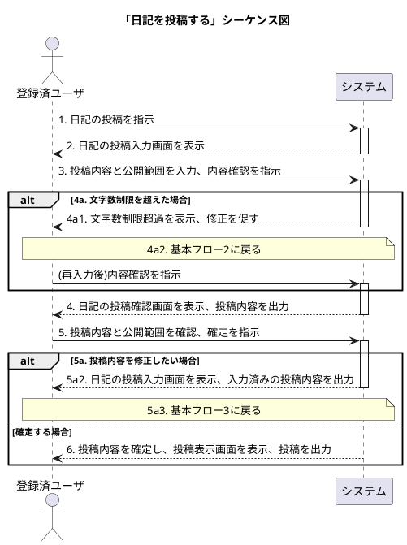
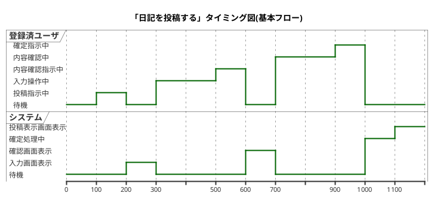
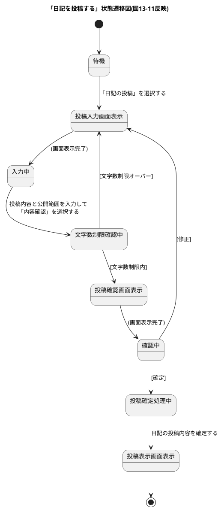
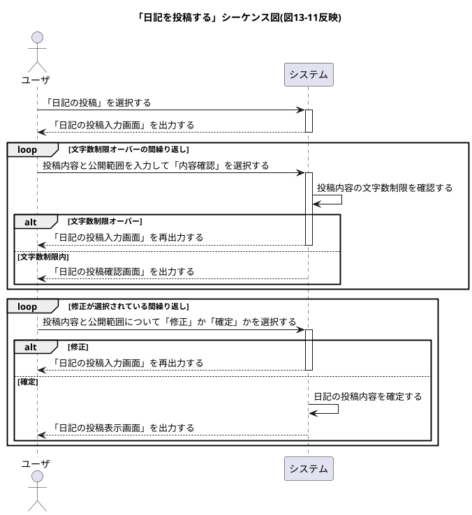
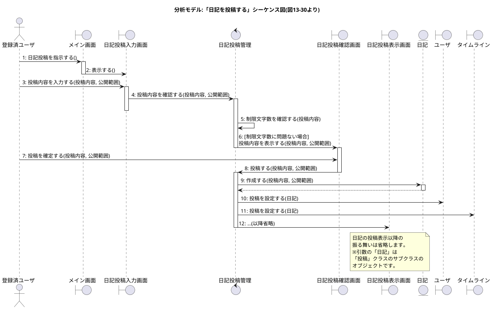

抽象データ型　ー＞　データ構造＋手続き：C++,JavaではClassという。

要求　ー＞　やりたいこと
　　　　　　自動でやってくれること

機能　ー＞　関数：ある入力に対して、出力が決まる。

非機能　＝＞　入力と出力以外のもの。
　　　　　　　ありとあらゆるものは出力に指定できる。
       　処理時間を出力にしたら、処理時間は機能

イベントフロー　ー＞　状態遷移図、シーケンス図、タイミング図
　その業種でよく使っている図を中心にし、そこから状態遷移、シーケンス、タイミングを自動生成できるとよい。
 
 、

分析　--> 設計と裏表
　設計なしに分析はできない。
　暗黙の設計を前提にしている。
 
設計：人が住む家（人の範囲、家の範囲、住む場所の範囲）

概念モデルは、Templateで描く。CLL、JAVA、RUST
　クラスは、具体的過ぎ・

 オブジェクト図　具体的なデータが入ったもの。型だけが決まってるのがクラス図、型も決まってないのがTemplate図

 コミュニケーション図は、シーケンス図に書き換えれる。時間の量が決まっている場合は、タイミング図。

 


# Q1 [uml/Day15/SNS.md at main · nagoyakaizen-star/uml](https://github.com/nagoyakaizen-star/uml/blob/main/Day15/SNS.md) にあるイベント表から、わかる範囲で、状態遷移図、シーケンス図、タイミング図をPlantUMLで記述してくだし。
A1 by claud


画像を確認しました。「表13-10:日記を投稿する」ユースケースのイベントフロー(基本フロー+代替フロー)から、状態遷移図・シーケンス図・タイミング図を作成します。

## 1. 状態遷移図

投稿処理全体を1つの状態機械として捉え、代替フロー(4a:文字数超過、5a:修正)もエラー/差し戻し遷移として表現しています。



## 2. シーケンス図

`alt`で代替フロー4a・5aの分岐を表現しています。



## 3. タイミング図

正常系(基本フロー1〜6)における、ユーザとシステムそれぞれの状態遷移タイミングを表しています。



**補足**
- 状態遷移図・シーケンス図には代替フロー(4a: 文字数制限超過、5a: 修正)を反映しましたが、タイミング図はPlantUMLの制約上、分岐表現が難しいため基本フロー(正常系)のみとしています。もし代替フローも別図として欲しい場合は追加で作成します。
- 実際の値(文字数制限の具体的な文字数、公開範囲の選択肢など)は表に記載がなかったため反映していません。追加情報があれば、より具体的な図に更新できます。


# Q2 参考までに、次の図も考慮して、更新してください。


A2
アクティビティ図(図13-11)を拝見しました。文字数制限チェックと「修正/確定」の分岐が、テキストのイベントフロー(4a・5a)よりも正確な位置・ラベルで描かれているので、それに合わせて3つの図を更新します。

## 1. 状態遷移図(更新版)



## 2. シーケンス図(更新版)



## 3. タイミング図(更新版)

分岐(ループ)を含む図なので、タイミング図は「文字数制限オーバーで1回差し戻された後、確定に至る」代表的な1本のシナリオとして表現しています。

```plantuml
@startuml diary_post_timing_v2
title 「日記を投稿する」タイミング図(図13-11反映・代表シナリオ)

robust "ユーザ" as User
robust "システム" as Sys

@0
User is 待機
Sys is 待機

@100
User is 投稿選択中

@200
User is 待機
Sys is 投稿入力画面出力

@300
User is 入力中(1回目)

@500
User is 内容確認選択中

@600
User is 待機
Sys is 文字数制限確認中

@700
Sys is 投稿入力画面再出力(オーバー)

@800
User is 入力中(2回目・修正)

@1000
User is 内容確認選択中

@1100
User is 待機
Sys is 文字数制限確認中

@1200
Sys is 投稿確認画面出力

@1300
User is 修正/確定選択中

@1500
User is 待機
Sys is 確定処理中

@1600
Sys is 投稿表示画面出力

@enduml
```

**更新のポイント**
- 「文字数制限確認」はテキストの代替フロー(4a)ではなく、**アクティビティ図では毎回必ず通る分岐処理**として描かれていたため、状態遷移図・シーケンス図とも通常フローの一部(loop/alt)に組み込みました。
- 「修正 or 確定」の分岐も同様に、確認画面表示後に必ず発生する分岐として表現しています。
- タイミング図は「1回文字数オーバーで差し戻された後に確定する」代表的な1シナリオのみを表しています。他のパターン(即確定、複数回の修正など)も見たい場合は追加で作成します。


# communication 


上記図から、シーケンス図と、できればタイミング図もPlantUMLで生成してください。

図13-30のコミュニケーション図を確認しました。番号(1〜12)とオブジェクト間の呼び出し関係を読み取り、シーケンス図とタイミング図に変換します。

**読み取りにあたっての前提(念のため確認させてください)**
- 5:「制限文字数を確認する(投稿内容)」は`:日記投稿管理`の自己呼び出し(自身の中で文字数チェックを行う処理)として解釈しました。
- 9:「作成する」で`:日記投稿管理`が`:日記`オブジェクトを新規生成し、10・11の「投稿を設定する(日記)」でその日記オブジェクトを`:ユーザ`と`:タイムライン`双方に紐付ける、という解釈にしています(図の注記どおり、引数は「投稿」クラスのサブクラス「日記」のオブジェクトです)。
- 12は「以降省略」なので、`:日記投稿表示画面`への遷移のみ簡略に表現しています。

もし5・10・11の向きが異なる場合は教えてください。それを踏まえて修正します。

## 1. シーケンス図



## 2. タイミング図

各オブジェクトが「アイドル/処理中」に切り替わるタイミングを、メッセージ番号1〜12の流れに沿って表しています。

```plantuml
@startuml diary_communication_timing
title 分析モデル:「日記を投稿する」タイミング図(図13-30より)

robust "登録済ユーザ" as User
robust "メイン画面" as Main
robust "日記投稿入力画面" as InputScreen
robust "日記投稿管理" as Manager
robust "日記投稿確認画面" as ConfirmScreen
robust "日記" as Diary
robust "ユーザ(日記保持)" as UserObj
robust "タイムライン" as Timeline
robust "日記投稿表示画面" as DisplayScreen

@0
User is アイドル
Main is アイドル
InputScreen is アイドル
Manager is アイドル
ConfirmScreen is アイドル
Diary is 未生成
UserObj is アイドル
Timeline is アイドル
DisplayScreen is アイドル

@100
User is 指示中(1)

@200
User is アイドル
Main is 表示処理中(2)

@300
Main is アイドル
InputScreen is 入力待ち

@400
User is 入力中(3)

@600
User is アイドル
InputScreen is 確認依頼中(4)

@700
InputScreen is アイドル
Manager is 文字数確認中(5)

@800
Manager is 確認画面表示中(6)
ConfirmScreen is 表示中

@900
User is 確定指示中(7)

@1000
User is アイドル
ConfirmScreen is 投稿依頼中(8)

@1100
ConfirmScreen is アイドル
Manager is 日記生成中(9)
Diary is 生成済み

@1200
Manager is 設定処理中(10,11)
UserObj is 設定済み
Timeline is 設定済み

@1300
Manager is 表示遷移中(12)
DisplayScreen is 表示中

@1400
Manager is アイドル

@enduml
```

**補足**
- コミュニケーション図には条件分岐(6の`[制限文字数に問題ない場合]`)以外の代替経路(文字数オーバー時の処理など)は描かれていなかったため、正常系のみを表現しています。
- 「9:作成する」で新規生成される`:日記`オブジェクトの生成タイミングを、シーケンス図では`activate`/`deactivate`、タイミング図では状態「未生成→生成済み」で表現しました。
- 
