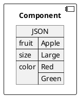
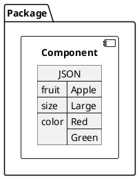
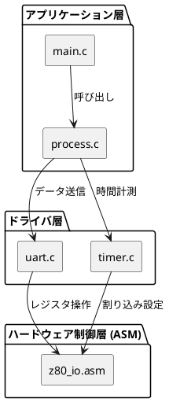
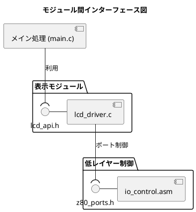

component
subsystem : composition : componentの中にcomponent

state diagramの集合がcomponent

stereotype
https://www.oxfordlearnersdictionaries.com/definition/english/stereotype_1?q=stereotype
https://www.bing.com/search?q=stereotype%20%20%E8%AA%9E%E6%BA%90&qs=n&form=QBRE&sp=-1&ghc=1&lq=0&pq=stereotype%20%20%E8%AA%9E%E6%BA%90&sc=12-14&sk=&cvid=AB405537A4DD46059EDEAA640FBE4C47

inetrface = service = function

port

delegate
https://www.oxfordlearnersdictionaries.com/definition/english/delegate_1?q=delegate
https://www.bing.com/search?q=delegate%20%20%E8%AA%9E%E6%BA%90&qs=n&form=QBRE&sp=-1&lq=0&pq=delegate%20%20%E8%AA%9E%E6%BA%90&sc=9-12&sk=&cvid=1EEB5C782E88456E818CC403CBBF0EB0

connector: interfaceの接合

# Q1 UMLでコンポーネントと、モジュールとパッケージの違いはなんですか。
A1 by gemini
UML（統一モデリング言語）において、**パッケージ**、**コンポーネント**、**モジュール**はどれもコードやシステムを構成する「塊（グループ）」を表しますが、その目的や抽象度のレイヤー（視点）が大きく異なります。

一言でいうと、パッケージは「フォルダ」、コンポーネントは「交換可能な部品」、モジュールは「実装コードの単位」です。

それぞれの違いを分かりやすく整理しました。

---

### 1. パッケージ（Package）

* **視点：** 設計・管理上の「整理整頓（グループ分け）」
* **意味：** 関連するクラスや図、他の要素をひとまとめにする論理的な「フォルダ（器）」です。
* **特徴：** パッケージ自体が何か特別な機能（ロジック）を持つわけではありません。単に名前空間を分けて、設計図が複雑になりすぎないように整理するために使います。
* **例：** `UIパッケージ`、`データアクセスパッケージ`、`共通ユーティリティパッケージ`

### 2. コンポーネント（Component）

* **視点：** 実行時・システム構成上の「物理的な部品」
* **意味：** 明確な役割と「インターフェース（窓口）」を持ち、**独立して差し替え（交換）が可能なシステムの物理的部品**です。
* **特徴：** 中身がどう実装されているか（ブラックボックス）は問わず、外部からは「提供する機能（Provided Interface）」と「要求する機能（Required Interface）」だけが見えます。
* **例：** `認証データベース`、`決済一括処理エンジン`、`暗号化プラグイン`（「これ単体で入れ替えられる」単位）

### 3. モジュール（Module）

* **視点：** ソースコード・実装上の「プログラムの単位」
* **意味：** 実際の開発言語（C言語、アセンブラ、Pythonなど）において、**一つの塊としてコンパイル・配置されるファイルやソースコードの単位**です。
* **特徴：** UMLの厳密な仕様というよりは、実装（デプロイメント）の文脈で使われることが多く、コンポーネントを構成する「具体的な中身（ソースファイル `.c` や `.asm`、ライブラリ `.dll` や `.a`）」を指します。
* **例：** `main.c`、`z80_io_driver.asm`

---

### 3つの違いの比較表

| 概念 | 例えるなら | 主な役割 | 結合の強さ | UML図での表記 |
| --- | --- | --- | --- | --- |
| **パッケージ** | **フォルダ・箱** | モデルやクラスの整理整頓（名前空間の分離） | 依存関係のみ（緩い） | タブのついたフォルダ型のアイコン |
| **コンポーネント** | **PCのグラフィックボード（パーツ）** | カプセル化された機能の提供と交換 | インターフェースによる疎結合 | 右上に２つの小さな四角がある箱、または `«component»` |
| **モジュール** | **基板の上の集積回路（ICチップ単体）** | 実際のコードの実装・ビルド単位 | 言語の仕様に依存（密〜疎） | コンポーネント図や配置図でのファイル表現 |

---

### Z80開発やDoxygenの文脈に当てはめると？

これまでお話ししてきたDoxygenやZ80の文脈に重ね合わせると、以下のようにイメージすると非常にすっきり理解できます。

* **パッケージ：** Doxygenのドキュメント内で、メニューを「ドライバ層」「メイン処理層」のように論理的に分類したグループ（`@defgroup` などで分ける単位）。
* **コンポーネント：** 「SDCCのC言語で書かれたロジック」と「アセンブラで書かれたハードウェア制御部」。お互いにヘッダーファイルを介してのみ繋がっている独立した部品。
* **モジュール：** 実際に作成した `main.c` や `driver.asm` といった、**個々のソースファイルそのもの**。

設計するときは「パッケージ」で大枠を整理し、システムの構造を考えるときは「コンポーネント」の繋がり（Graphvizで描くようなコールグラフ等）を意識し、実際にコードを書くときは「モジュール」単位でファイルを作る、というように視点を切り替えて使い分けます。UML（統一モデリング言語）において、**パッケージ**、**コンポーネント**、**モジュール**はどれもコードやシステムを構成する「塊（グループ）」を表しますが、その目的や抽象度のレイヤー（視点）が大きく異なります。

一言でいうと、パッケージは「フォルダ」、コンポーネントは「交換可能な部品」、モジュールは「実装コードの単位」です。

それぞれの違いを分かりやすく整理しました。

---

### 1. パッケージ（Package）

* **視点：** 設計・管理上の「整理整頓（グループ分け）」
* **意味：** 関連するクラスや図、他の要素をひとまとめにする論理的な「フォルダ（器）」です。
* **特徴：** パッケージ自体が何か特別な機能（ロジック）を持つわけではありません。単に名前空間を分けて、設計図が複雑になりすぎないように整理するために使います。
* **例：** `UIパッケージ`、`データアクセスパッケージ`、`共通ユーティリティパッケージ`

### 2. コンポーネント（Component）

* **視点：** 実行時・システム構成上の「物理的な部品」
* **意味：** 明確な役割と「インターフェース（窓口）」を持ち、**独立して差し替え（交換）が可能なシステムの物理的部品**です。
* **特徴：** 中身がどう実装されているか（ブラックボックス）は問わず、外部からは「提供する機能（Provided Interface）」と「要求する機能（Required Interface）」だけが見えます。
* **例：** `認証データベース`、`決済一括処理エンジン`、`暗号化プラグイン`（「これ単体で入れ替えられる」単位）

### 3. モジュール（Module）

* **視点：** ソースコード・実装上の「プログラムの単位」
* **意味：** 実際の開発言語（C言語、アセンブラ、Pythonなど）において、**一つの塊としてコンパイル・配置されるファイルやソースコードの単位**です。
* **特徴：** UMLの厳密な仕様というよりは、実装（デプロイメント）の文脈で使われることが多く、コンポーネントを構成する「具体的な中身（ソースファイル `.c` や `.asm`、ライブラリ `.dll` や `.a`）」を指します。
* **例：** `main.c`、`z80_io_driver.asm`

---

### 3つの違いの比較表

| 概念 | 例えるなら | 主な役割 | 結合の強さ | UML図での表記 |
| --- | --- | --- | --- | --- |
| **パッケージ** | **フォルダ・箱** | モデルやクラスの整理整頓（名前空間の分離） | 依存関係のみ（緩い） | タブのついたフォルダ型のアイコン |
| **コンポーネント** | **PCのグラフィックボード（パーツ）** | カプセル化された機能の提供と交換 | インターフェースによる疎結合 | 右上に２つの小さな四角がある箱、または `«component»` |
| **モジュール** | **基板の上の集積回路（ICチップ単体）** | 実際のコードの実装・ビルド単位 | 言語の仕様に依存（密〜疎） | コンポーネント図や配置図でのファイル表現 |

---

### Z80開発やDoxygenの文脈に当てはめると？

これまでお話ししてきたDoxygenやZ80の文脈に重ね合わせると、以下のようにイメージすると非常にすっきり理解できます。

* **パッケージ：** Doxygenのドキュメント内で、メニューを「ドライバ層」「メイン処理層」のように論理的に分類したグループ（`@defgroup` などで分ける単位）。
* **コンポーネント：** 「SDCCのC言語で書かれたロジック」と「アセンブラで書かれたハードウェア制御部」。お互いにヘッダーファイルを介してのみ繋がっている独立した部品。
* **モジュール：** 実際に作成した `main.c` や `driver.asm` といった、**個々のソースファイルそのもの**。

設計するときは「パッケージ」で大枠を整理し、システムの構造を考えるときは「コンポーネント」の繋がり（Graphvizで描くようなコールグラフ等）を意識し、実際にコードを書くときは「モジュール」単位でファイルを作る、というように視点を切り替えて使い分けます。

# plantuml

# Q2 plantumlでモジュール図を書くのはどうしたらいいですか。
A2 by Gemini
PlantUMLには「モジュール図」という名前の独立した図は定義されていませんが、一般的にモジュール図を表現する場合は、UMLの **「コンポーネント図（Component Diagram）」** または **「パッケージ図（Package Diagram）」** の構文を使用します。

特にC言語やアセンブラ、Z80などの開発において「ファイルごとの依存関係やレイヤー構造」を可視化したい場合は、**コンポーネント図の構文をベースに、`[ファイル名]` や `frame` を使って表現する**のが最も一般的で綺麗に書けます。

以下に、よく使われる2つのアプローチを示します。

---

### パターン1：レイヤー（層）とファイル依存関係を描く（おすすめ）

ハードウェア制御、ドライバ、メイン処理といった「階層構造」と、モジュール（ファイル）間の参照関係を表す書き方です。

#### 💡 書き方のポイント

* `skinparam componentStyle rectangle` を指定すると、コンポーネント（モジュール）がシンプルな四角形になり、ファイル図として見やすくなります。
* `package "..." { ... }` で囲むことで、フォルダやレイヤーごとのグループ分けができます。
* `[ファイル名]` と書くだけで、一つのモジュールとして定義されます。

---

### パターン2：インターフェースを意識した結合を描く

モジュール同士が「どのヘッダーファイル（関数定義）を介して繋がっているか」を明示したい場合の書き方です。UMLのコンポーネント図の「ソケットとピン」の表現を使います。

#### 💡 書き方のポイント

* `interface "ヘッダー名"` を使うことで、モジュールが公開している「関数やマクロの入り口」を表現できます。
* `--( `（丸かっこ）を使うとプラグ（利用側）、`-`（ハイフン）を使うとソケット（提供側）の形で線が繋がり、結合度の低さ（疎結合）を視覚的にアピールできます。

---

### どちらを使うべき？

* **ソースファイル（`.c` や `.asm`）の依存関係やインクルード関係を整理したい時**
👉 **パターン1** が最適です。Doxygenが自動生成するファイルグラフに近いものを、自分の手で綺麗に整理して描くことができます。
* **設計段階で、どの関数群（API）を使ってモジュールを結合させるかを議論したい時**
👉 **パターン2** が最適です。ファイルそのものよりも「境界線（インターフェース）」に注目した図になります。

PlantUMLはテキストで関係性を書くだけで Graphviz が自動的に綺麗に配置（レイアウト）してくれるため、モジュールの数が多くなっても手軽に修正できて便利です。
