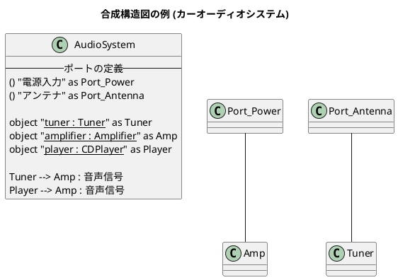
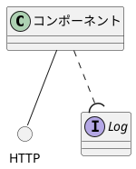

# Q1 PlantUMLで合成構造図を書くにはどうしたらいいですか。
A1 by Gemini
  PlantUMLには「合成構造図（Composite Structure Diagram）」専用の独立したモードはありませんが、**クラス図（Class Diagram）やコンポーネント図（Component Diagram）の構文を応用する**ことで、パーツ（内部構造）、ポート、提供・要求インターフェースといった合成構造図の要素をきれいに表現できます。

最も一般的かつUMLの仕様に近い表現ができる**クラス図の拡張構文を使った書き方**を解説します。

---

### 合成構造図の基本コード例

クラス（あるいはオブジェクト）の中に「パート」をネストさせ、外枠に「ポート」を配置して接続する基本的な書き方です。

---

### 書き方の3つのポイント

#### 1. 内部パート（Part）の表現

合成構造図の内部パーツは「クラスのインスタンス（役割）」であるため、`object "<u>名 : 型</u>"` の形式（オブジェクト図の書式）を使ってクラスの枠組みの中に記述するのが最適です。

#### 2. ポート（Port）の表現

ポートはインターフェース記号 `() "ポート名"` を応用して定義します。外枠となるクラスのすぐ近く、あるいは中に配置することで、外部との境界線にあるポートを表現できます。

#### 3. 提供・要求インターフェースの表現

コンポーネント図でおなじみの「ロリポップ（丸と半円）」表記を使う場合は、以下の記号を組み合わせます。

複雑なシステムを表現する場合は、外枠を `package` や `rectangle` で囲み、その中に `object` を配置していくアプローチをとると、より柔軟にレイアウトをコントロールできます。
