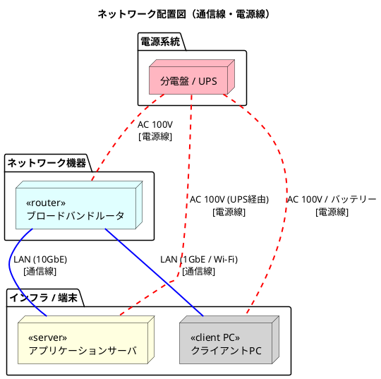
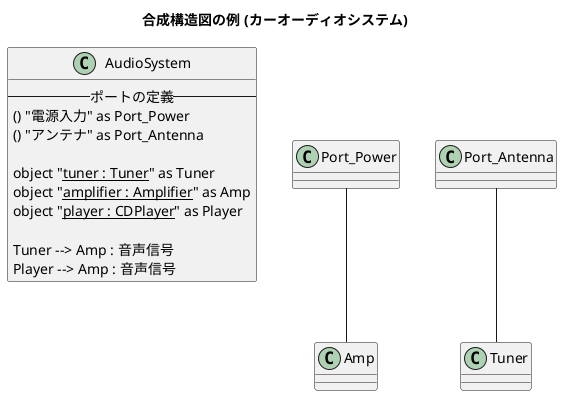
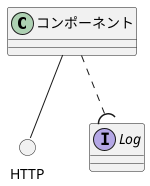

配置図は、ハードウェアの配置を書いてもいい。
電源線と通信線を区分する仕様はない。

# 配置図
## Q1　サーバ、クライアントPC、ルータを含むネットワークを、UMLの配置図で書いて、電源線と通信線もPlantUMLで記述してください。
A1 by Gemini

UMLの配置図（Deployment Diagram）の構文をベースに、各機器をノード（`node`）として定義し、通信線（青の実線）**と**電源線（赤の点線・太線）を色と線のスタイルで明確に描き分けたPlantUMLのコードです。

ネットワークのトポロジーとして、ルーターを中心にサーバーとクライアントPCが接続され、それぞれが分電盤やUPSなどの電源供給元につながる構造を表現しています。

```plantuml
@startuml
title ネットワーク配置図（通信線・電源線）

' スタイルの定義（線の色を分かりやすく識別するため）
skinparam Arrow {
  Thickness 2
}

' ---- 物理ノードの定義 ----
package "電源系統" {
  node "分電盤 / UPS" as PowerSource #LightPink
}

package "ネットワーク機器" {
  node "<<router>>\nブロードバンドルータ" as Router #LightCyan
}

package "インフラ / 端末" {
  node "<<server>>\nアプリケーションサーバ" as Server #LightYellow
  node "<<client PC>>\nクライアントPC" as ClientPC #LightGray
}

' ---- 線の記述 ----

' 1. 通信線の記述（青色：#Blue）
Router -[#Blue]- Server : LAN (10GbE)\n[通信線]
Router -[#Blue]- ClientPC : LAN (1GbE / Wi-Fi)\n[通信線]

' 2. 電源線の記述（赤色の点線・太線：#Red;line.dashed）
PowerSource -[#Red;line.dashed]- Router : AC 100V\n[電源線]
PowerSource -[#Red;line.dashed]- Server : AC 100V (UPS経由)\n[電源線]
PowerSource -[#Red;line.dashed]- ClientPC : AC 100V / バッテリー\n[電源線]

@enduml

```

### 記述のポイント

* **通信線と電源線の識別:** PlantUMLのインラインカラー（`-[#Color]-`）と線種指定（`line.dashed`）を使い、通信経路を「青の実線」、電源供給経路を「赤の破線」として視覚的に分離しています。
* **UML配置図のステレオタイプ:** 各ノードの役割を明確にするため、UMLの標準的な表記法である `<<server>>` などのステレオタイプをノード名に含めています。


## Q2 上記PlantUMLの記述は、Web版では次のエラーがでました。どうすればいいですか。「 Syntax Error? (Assumed diagram type: component)」
A2 
そのエラーは、PlantUMLのWebエディタがコードの記述から図のタイプ（この場合は配置図）を正しく自動判定できず、コンポーネント図だと誤認して構文エラーを起こしている状態です。

解決するには、矢印（線）の書き方を「配置図（あるいはクラス図）の標準的な文法」に修正する必要があります。PlantUMLの配置図では、矢印の中に直接 `line.dashed` などのスタイルを埋め込むとエラーになるケースがあります。

Web版でも確実に動く、修正済みのコードは以下の通りです。



### 修正したポイント

* **線のスタイル指定を簡略化:** `-[#Red;line.dashed]-` という書き方を、より互換性の高い **`-[#red,dashed]-`** （カンマ区切り）に変更しました。Web版の古いパーサーや特定のレンダラーでも、この書き方であれば配置図として正常にパースされます。


# 合成構造図
## Q1 PlantUMLで合成構造図を書くにはどうしたらいいですか。
A1 by Gemini
  PlantUMLには「合成構造図（Composite Structure Diagram）」専用の独立したモードはありませんが、**クラス図（Class Diagram）やコンポーネント図（Component Diagram）の構文を応用する**ことで、パーツ（内部構造）、ポート、提供・要求インターフェースといった合成構造図の要素をきれいに表現できます。

最も一般的かつUMLの仕様に近い表現ができる**クラス図の拡張構文を使った書き方**を解説します。

---

### 合成構造図の基本コード例

クラス（あるいはオブジェクト）の中に「パート」をネストさせ、外枠に「ポート」を配置して接続する基本的な書き方です。



---

### 書き方の3つのポイント

#### 1. 内部パート（Part）の表現

合成構造図の内部パーツは「クラスのインスタンス（役割）」であるため、`object "<u>名 : 型</u>"` の形式（オブジェクト図の書式）を使ってクラスの枠組みの中に記述するのが最適です。

#### 2. ポート（Port）の表現

ポートはインターフェース記号 `() "ポート名"` を応用して定義します。外枠となるクラスのすぐ近く、あるいは中に配置することで、外部との境界線にあるポートを表現できます。

#### 3. 提供・要求インターフェースの表現

コンポーネント図でおなじみの「ロリポップ（丸と半円）」表記を使う場合は、以下の記号を組み合わせます。



複雑なシステムを表現する場合は、外枠を `package` や `rectangle` で囲み、その中に `object` を配置していくアプローチをとると、より柔軟にレイアウトをコントロールできます。
