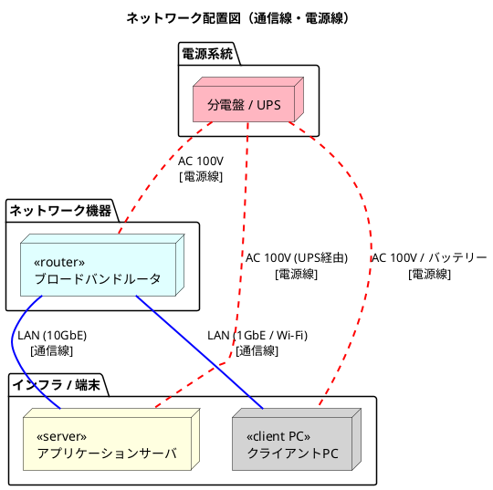
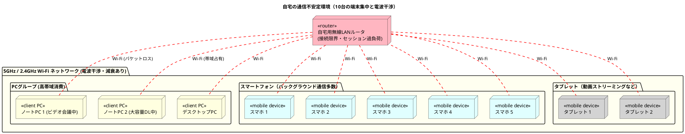
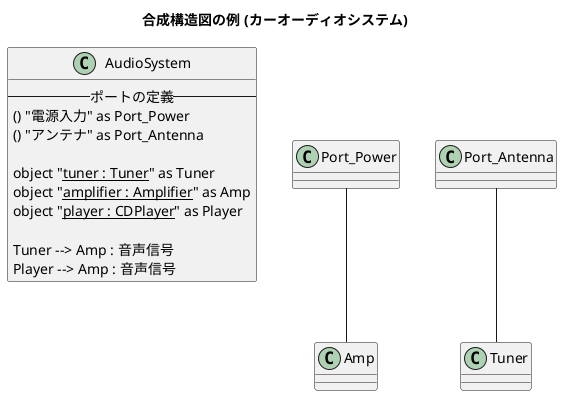
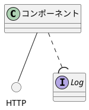

配置図は、ハードウェアの配置を書いてもいい。
電源線と通信線を区分する仕様はない。

# 配置図
## Q1　サーバ、クライアントPC、ルータを含むネットワークを、UMLの配置図で書いて、電源線と通信線もPlantUMLで記述してください。
A1 by Gemini

UMLの配置図（Deployment Diagram）の構文をベースに、各機器をノード（`node`）として定義し、通信線（青の実線）**と**電源線（赤の点線・太線）を色と線のスタイルで明確に描き分けたPlantUMLのコードです。

ネットワークのトポロジーとして、ルーターを中心にサーバーとクライアントPCが接続され、それぞれが分電盤やUPSなどの電源供給元につながる構造を表現しています。

```plantuml
@startuml
title ネットワーク配置図（通信線・電源線）

' スタイルの定義（線の色を分かりやすく識別するため）
skinparam Arrow {
  Thickness 2
}

' ---- 物理ノードの定義 ----
package "電源系統" {
  node "分電盤 / UPS" as PowerSource #LightPink
}

package "ネットワーク機器" {
  node "<<router>>\nブロードバンドルータ" as Router #LightCyan
}

package "インフラ / 端末" {
  node "<<server>>\nアプリケーションサーバ" as Server #LightYellow
  node "<<client PC>>\nクライアントPC" as ClientPC #LightGray
}

' ---- 線の記述 ----

' 1. 通信線の記述（青色：#Blue）
Router -[#Blue]- Server : LAN (10GbE)\n[通信線]
Router -[#Blue]- ClientPC : LAN (1GbE / Wi-Fi)\n[通信線]

' 2. 電源線の記述（赤色の点線・太線：#Red;line.dashed）
PowerSource -[#Red;line.dashed]- Router : AC 100V\n[電源線]
PowerSource -[#Red;line.dashed]- Server : AC 100V (UPS経由)\n[電源線]
PowerSource -[#Red;line.dashed]- ClientPC : AC 100V / バッテリー\n[電源線]

@enduml

```

### 記述のポイント

* **通信線と電源線の識別:** PlantUMLのインラインカラー（`-[#Color]-`）と線種指定（`line.dashed`）を使い、通信経路を「青の実線」、電源供給経路を「赤の破線」として視覚的に分離しています。
* **UML配置図のステレオタイプ:** 各ノードの役割を明確にするため、UMLの標準的な表記法である `<<server>>` などのステレオタイプをノード名に含めています。


## Q2 上記PlantUMLの記述は、Web版では次のエラーがでました。どうすればいいですか。「 Syntax Error? (Assumed diagram type: component)」
A2 
そのエラーは、PlantUMLのWebエディタがコードの記述から図のタイプ（この場合は配置図）を正しく自動判定できず、コンポーネント図だと誤認して構文エラーを起こしている状態です。

解決するには、矢印（線）の書き方を「配置図（あるいはクラス図）の標準的な文法」に修正する必要があります。PlantUMLの配置図では、矢印の中に直接 `line.dashed` などのスタイルを埋め込むとエラーになるケースがあります。

Web版でも確実に動く、修正済みのコードは以下の通りです。



### 修正したポイント

* **線のスタイル指定を簡略化:** `-[#Red;line.dashed]-` という書き方を、より互換性の高い **`-[#red,dashed]-`** （カンマ区切り）に変更しました。Web版の古いパーサーや特定のレンダラーでも、この書き方であれば配置図として正常にパースされます。


## Q3 UMLの配置図って、ソフトウェアで書くとすると、どういう場合がありますか。８つ示してください。実例があれば、Wikipedia以外のURLを示してください。
A3
UMLの配置図（Deployment Diagram）は、ソフトウェア工学において「成果物（プログラム、ファイル、DBなど）」が、「どの物理ハードウェアや仮想的な実行環境（OS、コンテナ、サーバーなど）上で、どのように配置されて動くのか」という、インフラとソフトウェアの物理的なトポロジー（関係性）を設計・可視化するときに使われます。

ソフトウェア開発において、配置図が具体的にどのようなケースで書かれるのか、実例の参照URLとともに8つのシチュエーションを示します。

---

### 1. マイクロサービス・Webシステムの多層（マルチティア）アーキテクチャ設計

最も一般的なケースです。Webブラウザ（クライアントノード）、APIゲートウェイ、複数のマイクロサービス（コンテナノード）、およびバックエンドデータベースが、それぞれどのサーバーやネットワークセグメント（DMZ、プライベートLAN）に配置され、HTTPやgRPCでどう通信するかをマッピングします。

* **実例・解説リンク（Software Ideas Modeler）:** [E-commerce Microservices (UML Deployment Diagram)](https://www.google.com/search?q=https://www.softwareideas.net/a/1580/e-commerce-microservices-uml-diagram-)

### 2. オンプレミスからクラウド（AWS/Azure/GCP）への移行プラン策定

レガシーな自社サーバー（オンプレミス環境）で動いていたシステムを、AWSなどのパブリッククラウドへ移行する際、既存の物理トポロジーがクラウド上の仮想ノード（VPC、EC2、RDSなど）にどうマッピングされるかを新旧で比較・定義するために作成されます。

* **実例・解説リンク（Architect View Master）:** [Deployment Diagrams: The C4 Way to Stop Confusing Everyone](https://www.architectviewmaster.com/blog/deployment-diagrams-the-c4-way-to-stop-confusing-everyone/)

### 3. モバイルアプリ（iOS/Android）とバックエンドAPIの協調設計

スマートフォンという「端末デバイスノード（Android/iOS）」のローカル環境（内部のSQLite DBや、アプリ本体の成果物）が、インターネット経由で「金融系システムや認証サーバー（Linuxノード）」とどのようにセキュアに通信するかという境界線を描く場合に使われます。

* **実例・解説リンク（GeeksforGeeks）:** [Deployment Diagram for Mobile Banking Android Services](https://www.geeksforgeeks.org/system-design/deployment-diagram-unified-modeling-languageuml/)

### 4. 組み込みシステム・IoT（Edge-to-Cloud）のトポロジー設計

スマート家電、自動車のECU、工場内のセンサーなどの「物理デバイス（エッジノード）」と、それらを束ねる「ゲートウェイ機器」、そしてデータを吸い上げる「クラウド基盤」の間の三層構造を定義します。ハードウェアの制約と、ソフトウェアの配置場所を同時に表現できる配置図の強みが活きる分野です。

* **実例・解説リンク（Agile Modeling）:** [UML Deployment Diagrams: An Agile Introduction](https://agilemodeling.com/artifacts/deploymentdiagram.htm)

### 5. 冗長化（ロードバランサ）と可用性・負荷分散の設計

システムの可用性を高めるため、ロードバランサの配下に何台のアプリケーションサーバー（複製された同一ノード）を並べるか、データベースをマスタ・レプリカ構成（アクティブ・スタンバイ）にしてどの筐体に分散させるかといった、可用性（HA）設計に用いられます。

* **実例・解説リンク（Lucidchart）:** [Deployment Diagram Tutorial and Examples](https://lucid.co/diagram/uml/deployment-diagram-tutorial)

### 6. 企業内システムのインテグレーション・認証連携（SSO）

大学の学務システムや、企業の基幹システム（ERP）などにおいて、既存の「Active Directory（認証サーバーノード）」と、新設する「業務アプリケーションサーバー」が、企業内ファイアウォールの前後でどのようにパケットを行き来させるかをセキュリティ観点で明示します。

* **実例・解説リンク（Cybermedian）:** [UML Deployment Diagram for Modern System Architecture](https://www.cybermedian.com/a-comprehensive-case-study-on-ai-enhanced-uml-deployment-diagrams-for-modern-system-architecture/)

### 7. DevOpsにおけるCI/CDパイプラインとデプロイ先環境の定義

開発環境（Staging）と本番環境（Production）でノードの構成（ステージングは1台のVM、本番はKubernetesクラスターなど）が異なる場合、ビルドされた成果物（.warファイルやDockerイメージ）が、どの環境のどの実行コンテキストにデプロイされるかのプロセスを定義します。

* **実例・解説リンク（InfraSketch）:** [Architecture Diagram Best Practices](https://infrasketch.net/blog/architecture-diagram-best-practices)

### 8. 分散メッセージング・イベント駆動型システム（Kafka/RabbitMQ）の配置

データ流量が非常に多いデータ分析基盤などで、メッセージブローカー（Apache Kafkaなどのクラスタノード）をどこに配置し、パブリッシャー（データ送信側）とサブスクライバー（データ受信・処理側）がどの物理サーバー群で分散処理を行うかを可視化するために記述されます。

* **実例・解説リンク（Visual Paradigm）:** [Deployment Diagram for Microservices Architecture](https://chat.visual-paradigm.com/deployment-diagram-for-microservices-architecture-a-practical-overview/)

## manifest
MakefileがCのソース
Manifestは、ヘッダファイル

## Q4 自宅で通信環境が不安定な場合の、PC、スマフォ、タブレットが１０台とルータがる例を、UMLの配置図で書いてみてください。
A4 
自宅の通信環境が不安定（Wi-Fiの電波干渉やルーターのセッション詰まりなど）で、合計10台の端末が1台のルーターに集中している超過密な状況を表現したUML配置図のPlantUMLコードです。

Web版でも確実にエラーなくレンダリングできるよう、互換性の高い構文で記述しています。



### この配置図のポイント

* **ボトルネックの可視化:** 中心にある `Router` を赤色（`#LightPink`）にし、1台に対してPC3台、スマホ5台、タブレット2台の計10台が1つの無線帯域に群がっている「過密状態」を表現しています。
* **通信線の表現:** 正常なネットワークであれば青の実線などで引きますが、今回は通信環境が不安定というトラブル状況を表現するため、すべての接続線を赤の点線（`-[#red,dashed]-`）にしています。


# 合成構造図
## Q1 PlantUMLで合成構造図を書くにはどうしたらいいですか。
A1 by Gemini
  PlantUMLには「合成構造図（Composite Structure Diagram）」専用の独立したモードはありませんが、**クラス図（Class Diagram）やコンポーネント図（Component Diagram）の構文を応用する**ことで、パーツ（内部構造）、ポート、提供・要求インターフェースといった合成構造図の要素をきれいに表現できます。

最も一般的かつUMLの仕様に近い表現ができる**クラス図の拡張構文を使った書き方**を解説します。

---

### 合成構造図の基本コード例

クラス（あるいはオブジェクト）の中に「パート」をネストさせ、外枠に「ポート」を配置して接続する基本的な書き方です。



---

### 書き方の3つのポイント

#### 1. 内部パート（Part）の表現

合成構造図の内部パーツは「クラスのインスタンス（役割）」であるため、`object "<u>名 : 型</u>"` の形式（オブジェクト図の書式）を使ってクラスの枠組みの中に記述するのが最適です。

#### 2. ポート（Port）の表現

ポートはインターフェース記号 `() "ポート名"` を応用して定義します。外枠となるクラスのすぐ近く、あるいは中に配置することで、外部との境界線にあるポートを表現できます。

#### 3. 提供・要求インターフェースの表現

コンポーネント図でおなじみの「ロリポップ（丸と半円）」表記を使う場合は、以下の記号を組み合わせます。



複雑なシステムを表現する場合は、外枠を `package` や `rectangle` で囲み、その中に `object` を配置していくアプローチをとると、より柔軟にレイアウトをコントロールできます。
