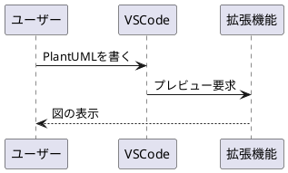

# Q1 Visual CodeでPlantUMLを利用するにはどうしたらいいですか。
A1 by Gemini
Visual Studio Code（VS Code）でPlantUMLを使ってサクサク図を描くための、最も手軽で標準的な環境構築ステップを解説します。

昔はJavaやGraphvizの個別インストールが必須で面倒でしたが、現在は**VS Codeの拡張機能だけで完結する（Java不要の）方法**が主流です。

---

## 導入手順

1. **PlantUML拡張機能のインストール:** 所要時間: 1分.
VS Codeの拡張機能マーケットプレイス（`Ctrl+Shift+X` または `Cmd+Shift+X`）を開き、**「PlantUML」**（作者: jebbs）を検索してインストールします。

2. **プレビューレンダラーの切り替え（Java・Graphviz不要の設定）:** 所要時間: 1分.
1. VS Codeの設定（`Ctrl+,` または `Cmd+,`）を開きます。
2. 検索窓に `plantuml server` と入力します。
3. **「Plantuml: Render」** という設定項目を、デフォルトの `Local` から **`PlantUMLServer`** に変更します。

3. **ファイルの作成と記述:** 所要時間: 1分.
新規ファイルを作成し、拡張子を **`.puml`**（または `.wsd`）にして保存します。ファイル内に以下のサンプルコードを貼り付けてみてください。

4. **プレビューの表示:** 所要時間: 1秒.
コードが書けたら、**`Alt + D`**（Macは **`Option + D`**）を押します。画面が分割され、右側にリアルタイムにレンダリングされた図が表示されます。

---

## 便利な使い方と Tips

* **図の書き出し（エクスポート）**
コード上で右クリックし、**「現在の図をエクスポート（Export Current Diagram）」** を選択すると、PNGやSVG、PDFなどの形式で図を保存できます。
* **オフラインで完全にローカル完結させたい場合**
上記手順の「PlantUMLServer」は、拡張機能が用意している公開サーバーを利用して図を生成します。もし社外へのコード送信がNGの環境（完全オフライン環境）の場合は、従来通りPCに **Java** と **Graphviz** をインストールし、設定を `Local` に戻してご利用ください。

# Q2 VS CodeでPlantUMLを完全ローカル（オフライン環境・JavaとGraphvizを使用）で動かすための具体的な手順を教えてください。
A2
機密保持などの理由で外部サーバー（PlantUMLServer）にコードを送信できない場合、PCローカルに **Java** と **Graphviz（描画エンジン）** を導入することで、完全オフラインのセキュアな環境を構築できます。

具体的な手順は以下の通りです。

---

## 完全ローカル環境の構築手順

1. **Java（JRE/JDK）のインストール:** 所要時間: 3分.
PlantUMLを動かすための実行環境をインストールします。

* **Windows (Scoop/Winget利用の場合):** コマンドプロンプト等で `winget install Microsoft.OpenJDK.21` を実行、または公式（[Adoptium](https://adoptium.net/)等）からインストーラーをダウンロードして導入します。
* **Mac (Homebrew利用の場合):** ターミナルで `brew install openjdk` を実行します。
* **確認:** ターミナルで `java -version` と入力し、バージョンが表示されれば成功です。

2. **Graphviz（グラフィック描画エンジン）のインストール:** 所要時間: 2分.
シーケンス図以外の複雑な図（クラス図やコンポーネント図など）を描画するために必須のソフトです。

* **Windows:** [Graphviz公式ページ](https://graphviz.org/download/)からWindows用インストーラー（EXE）をダウンロードしてインストールします。**※インストール途中で「Add Graphviz to the system PATH for all users」に必ずチェックを入れてください。**
* **Mac:** ターミナルで `brew install graphviz` を実行します。

3. **VS CodeのPlantUML設定を「Local」に戻す:** 所要時間: 1分.
1. VS Codeの設定（`Ctrl+,` または `Cmd+,`）を開きます。
2. 検索窓に `plantuml render` と入力します。
3. **「Plantuml: Render」** の項目を **`Local`** に変更（または戻す）します。これでお使いのPC内のJavaを使って処理するようになります。

4. **動作確認:** 所要時間: 30秒.
`.puml` ファイルを開き、**`Alt + D`**（Macは **`Option + D`**）を押してプレビューが表示されるか確認します。

もし「Graphvizが見つかりません」といったエラーが出る場合は、PCを一度再起動するか、VS Codeの設定で `plantuml.jar` や `graphviz` の直接パスを指定してください（通常は自動認識されます）。

---

> 💡 **社内共有時のプロの技**
> 完全ローカル環境であれば、VS Code上で右クリックして「現在の図をエクスポート」を選択した際、ネットワークに一切触れることなく瞬時に高解像度なSVGやPNGが手元のフォルダに生成されます。

# Q3 WindowsのVisual Studio(Visual C)でもPlantUML拡張は動きますか。
A3 
結論からお伝えすると、**Microsoftの「Visual Studio」（いわゆる本家VS、Visual C++などを含む重厚なIDE）には、VS Codeのような「PlantUML」公式・定番の拡張機能がありません。**

そのため、Visual Studioの画面内でVS Codeと全く同じようにスムーズにPlantUMLを動かすのは難しいのが現状です。

もしVisual Studioを中心とした開発環境でPlantUMLを利用したい場合、一般的には以下の**3つの代替策**のいずれかで運用します。

---

## Visual Studio環境での3つの現実的な対策

### ①【推奨】VS Codeを「横に並べて」連携させる

最もストレスがなく、多くのエンジニアが採用している方法です。

* コード（C++など）の編集やビルドは **Visual Studio** で行います。
* 設計書や仕様書（`.puml` や `.md`）の編集・プレビューは、軽量な **VS Code** を横で立ち上げて行います。
* 同じソースツリー（フォルダ）を両方で開いておくだけなので、管理上の競合は起きません。

### ② Visual Studioの「外部ツール」として登録する

Visual Studioのメニューバーから、PlantUML（JARファイル）をバッチ処理的に呼び出して、ボタン一発でPNGなどの図を出力させる方法です。画面内での「リアルタイムプレビュー」はできませんが、成果物の自動生成が可能です。

* **設定方法（概要）:**
1. ツール ＞ **外部ツール** を開きます。
2. タイトルに「`PlantUML生成`」と入力。
3. コマンドに `java.exe` のパスを指定。
4. 引数に `-jar "C:\path\to\plantuml.jar" "$(ItemPath)"` を指定。

* これにより、開いている`.puml`ファイルをVisual Studio上からコンパイル（画像化）できるようになります。

### ③ サードパーティ製の拡張機能（アドイン）を探す

Visual Studioの「拡張機能の管理（Marketplace）」で「PlantUML」と検索すると、個人やコミュニティが開発したアドイン（例: `PlantUmlStudio` や `PlantUML Viewer` など、バージョンによって存在）が見つかることがあります。

* **注意点:** これらはVS Code版ほど頻繁にアップデートされておらず、最新のVisual Studio（VS 2022など）に対応していなかったり、動作が不安定だったりすることが多いため、あまりおすすめはできません。

---

> 📌 **まとめ**
> 拡張機能がそのまま動くわけではないため、仕様書作成用に **VS Codeをサブエディタとして併用する** のが最も快適で確実なアプローチです。
