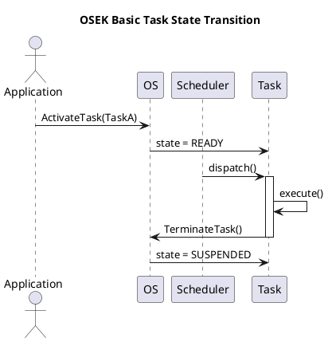
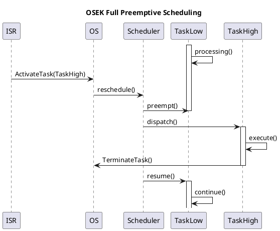
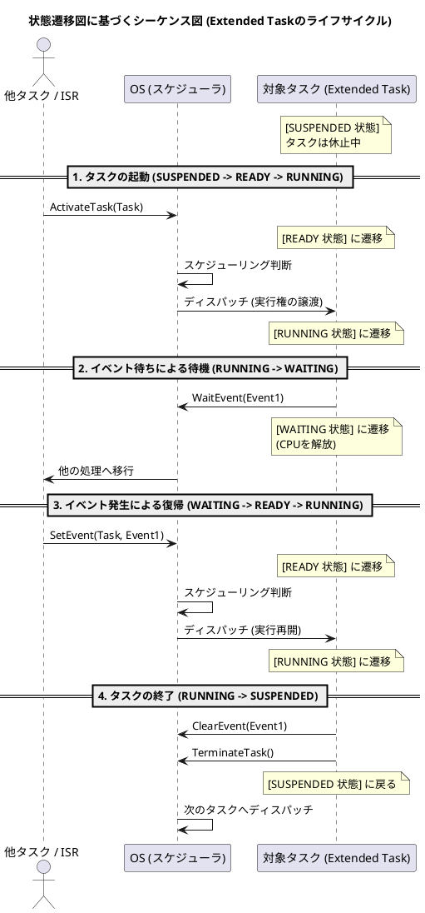
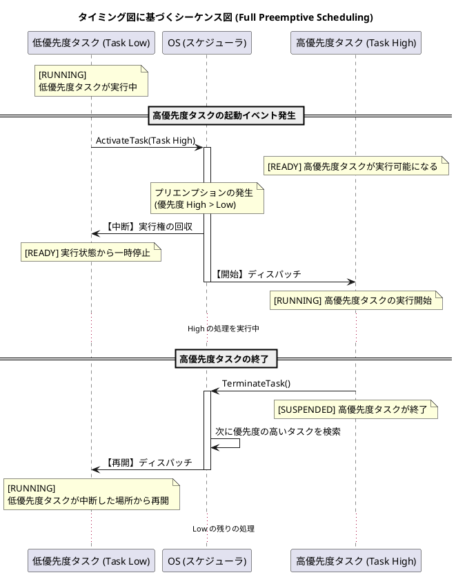

# Q1 https://www.osek-vdx.org/mirror/os21_rc1.pdf に出てくる状態遷移図、タイミング図からシーケンス図をそれぞれ一つづつ作成してください。
A1 by Chatgpt
はい。OSEK OS 2.1r1には、

* **状態遷移図 (State Transition Diagram)**（Figure 4-1, 4-3など）
* **タイミング図 (Timing Chart)**（Figure 4-6 Full preemptive scheduling、Figure 4-7 Non preemptive scheduling）

が掲載されています。([OSEK VDX][1])

これらをUMLシーケンス図へ変換した例を示します。

---

# ① 状態遷移図（Basic Task State Model）→ シーケンス図

元の状態遷移

```
Suspended
    |
ActivateTask()
    |
Ready
    |
Scheduler
    |
Running
    |
TerminateTask()
    |
Suspended
```

これをシーケンス図にすると、




ポイント

* 状態遷移図では「状態」が主役
* シーケンス図では「API呼び出し」が主役
* SchedulerがReady→Runningを担当することが明確になります。

---

# ② Full Preemptive Scheduling（Timing Chart）→ シーケンス図

タイミング図では

```
TaskLow
|
|-------------------------
|
          ↑
      ActivateTask(High)

TaskHigh
             |---------|
```

という時間変化が描かれています。([Scribd][2])

これをシーケンス図にすると




ここでは

* ISRが高優先度タスクを起動
* Schedulerが即座にプリエンプト
* 高優先度終了後に元のタスクを再開

という流れがタイミング図より読み取りやすくなります。

---

# UML的な対応関係

| OSEK図                    | UML図                  | 主な表現対象       |
| ------------------------ | --------------------- | ------------ |
| State Transition Diagram | State Machine Diagram | 状態と遷移        |
| Timing Chart             | Timing Diagram        | 時間軸          |
| API呼び出しの流れ               | Sequence Diagram      | メッセージ交換      |
| Schedulerの動作             | Sequence Diagram      | オブジェクト間の相互作用 |

---

AUTOSARやOSEKの仕様書をUMLへ置き換える場合は、**状態遷移図・タイミング図・シーケンス図を相互に対応付ける**と理解しやすくなります。例えば、状態遷移図で示される **Activate → Ready → Running → Terminate** のライフサイクルを、シーケンス図では `ActivateTask()`、スケジューラによるディスパッチ、`TerminateTask()` のメッセージとして表現でき、タイミング図ではそれらが時間軸上でどのように発生するかを示せます。これは仕様レビューや設計レビューでも有効な表現方法です。

[1]: https://www.osek-vdx.org/osekvdx_os.html?utm_source=chatgpt.com "OS"
[2]: https://www.scribd.com/doc/47007279/Programming-in-the-OSEK-VDX-Environment-With-CD-ROM?utm_source=chatgpt.com "Programming in The OSEK-VDX Environment (With CD-ROM) | PDF | Computer Engineering | Intellectual Works"

Q1 https://www.osek-vdx.org/mirror/os21_rc1.pdf に出てくる状態遷移図、タイミング図からシーケンス図をそれぞれ一つづつ作成してください。
A1  by Gemini
OSEK/VDX OS 仕様書（v2.1）に登場する代表的な「タスクの状態遷移図（Task State Transitions）」**および**「フルプリエンプティブ・スケジューリングのタイミング図（Full Preemptive Scheduling）」のシナリオをベースに、それぞれの挙動を視覚化するPlantUMLのシーケンス図を作成しました。

そのままPlantUMLのエディタに貼り付けてレンダリングできます。

---

### 1. 状態遷移図（Extended Taskモデル）に基づくシーケンス図

仕様書の「Figure 4-1 (タスク状態遷移図)」における、**SUSPENDED（休止） → READY（実行可能） → RUNNING（実行中） → WAITING（待ち） → READY → RUNNING → SUSPENDED** という一連のライフサイクル遷移を表現しています。




---

### 2. タイミング図（フルプリエンプティブ）に基づくシーケンス図

仕様書の「Figure 4-5 (Full Preemptive Scheduling)」等で示される、「低優先度タスクの実行中に、高優先度タスクが起動して割り込む（プリエンプション）」というタイミングチャートのシナリオを表現しています。




---

### 作成のポイント

* **状態の明示:** OSEKの仕様書で重要となるタスク状態（`SUSPENDED`, `READY`, `RUNNING`, `WAITING`）の変化が視覚的に追えるよう、`note over` を使ってタイムライン上に明記しています。
* **APIのコール:** 状態遷移やタイミング変化のトリガーとなる `ActivateTask`、`WaitEvent`、`TerminateTask` といった OSEK OS 標準のシステムサービス（API呼び出し）をメッセージラインとして表現しています。

