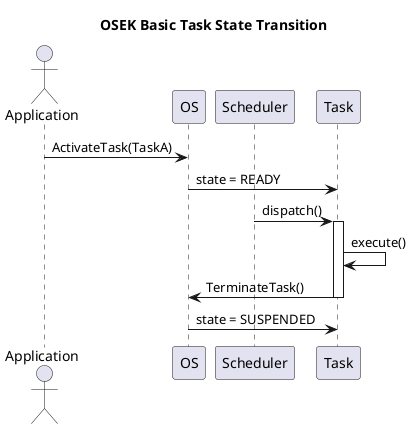
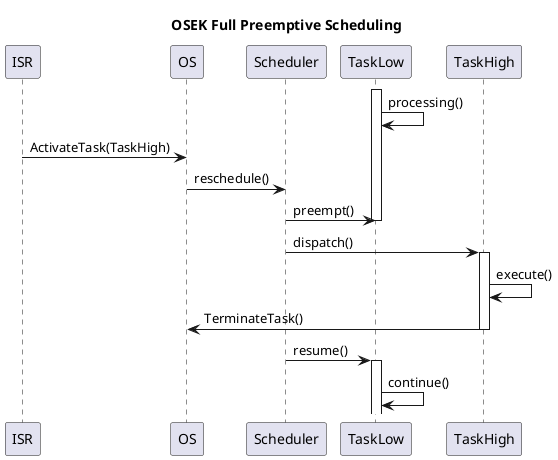
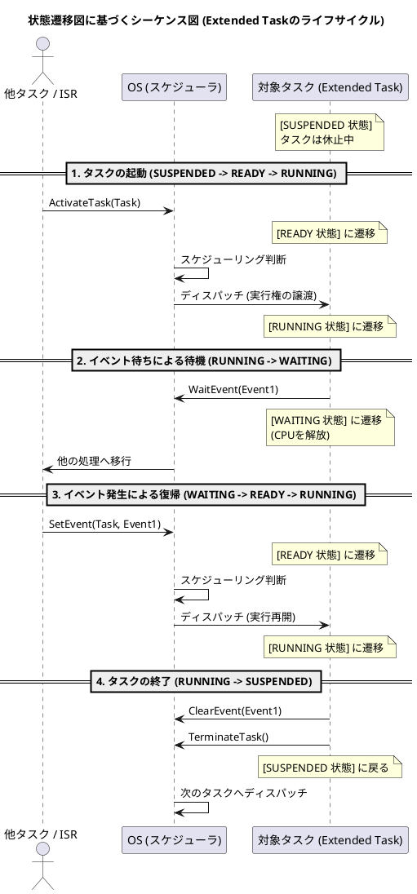
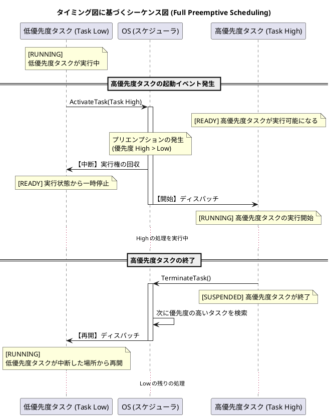
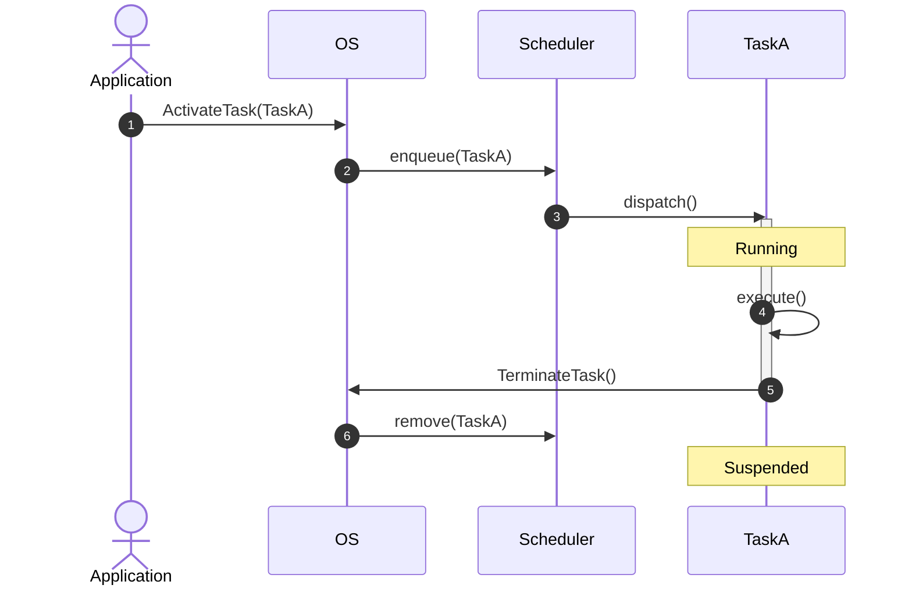
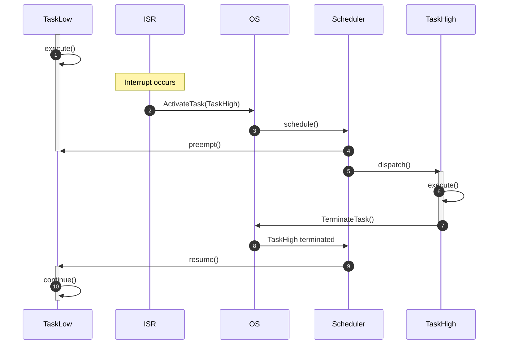

# Q1 https://www.osek-vdx.org/mirror/os21_rc1.pdf に出てくる状態遷移図、タイミング図からシーケンス図をそれぞれ一つづつ作成してください。
A1 by Chatgpt
はい。OSEK OS 2.1r1には、

* **状態遷移図 (State Transition Diagram)**（Figure 4-1, 4-3など）
* **タイミング図 (Timing Chart)**（Figure 4-6 Full preemptive scheduling、Figure 4-7 Non preemptive scheduling）

が掲載されています。([OSEK VDX][1])

これらをUMLシーケンス図へ変換した例を示します。

---

# ① 状態遷移図（Basic Task State Model）→ シーケンス図

元の状態遷移

```
Suspended
    |
ActivateTask()
    |
Ready
    |
Scheduler
    |
Running
    |
TerminateTask()
    |
Suspended
```

これをシーケンス図にすると、




ポイント

* 状態遷移図では「状態」が主役
* シーケンス図では「API呼び出し」が主役
* SchedulerがReady→Runningを担当することが明確になります。

---

# ② Full Preemptive Scheduling（Timing Chart）→ シーケンス図

タイミング図では

```
TaskLow
|
|-------------------------
|
          ↑
      ActivateTask(High)

TaskHigh
             |---------|
```

という時間変化が描かれています。([Scribd][2])

これをシーケンス図にすると




ここでは

* ISRが高優先度タスクを起動
* Schedulerが即座にプリエンプト
* 高優先度終了後に元のタスクを再開

という流れがタイミング図より読み取りやすくなります。

---

# UML的な対応関係

| OSEK図                    | UML図                  | 主な表現対象       |
| ------------------------ | --------------------- | ------------ |
| State Transition Diagram | State Machine Diagram | 状態と遷移        |
| Timing Chart             | Timing Diagram        | 時間軸          |
| API呼び出しの流れ               | Sequence Diagram      | メッセージ交換      |
| Schedulerの動作             | Sequence Diagram      | オブジェクト間の相互作用 |

---

AUTOSARやOSEKの仕様書をUMLへ置き換える場合は、**状態遷移図・タイミング図・シーケンス図を相互に対応付ける**と理解しやすくなります。例えば、状態遷移図で示される **Activate → Ready → Running → Terminate** のライフサイクルを、シーケンス図では `ActivateTask()`、スケジューラによるディスパッチ、`TerminateTask()` のメッセージとして表現でき、タイミング図ではそれらが時間軸上でどのように発生するかを示せます。これは仕様レビューや設計レビューでも有効な表現方法です。

[1]: https://www.osek-vdx.org/osekvdx_os.html?utm_source=chatgpt.com "OS"
[2]: https://www.scribd.com/doc/47007279/Programming-in-the-OSEK-VDX-Environment-With-CD-ROM?utm_source=chatgpt.com "Programming in The OSEK-VDX Environment (With CD-ROM) | PDF | Computer Engineering | Intellectual Works"

Q1 https://www.osek-vdx.org/mirror/os21_rc1.pdf に出てくる状態遷移図、タイミング図からシーケンス図をそれぞれ一つづつ作成してください。
A1  by Gemini
OSEK/VDX OS 仕様書（v2.1）に登場する代表的な「タスクの状態遷移図（Task State Transitions）」**および**「フルプリエンプティブ・スケジューリングのタイミング図（Full Preemptive Scheduling）」のシナリオをベースに、それぞれの挙動を視覚化するPlantUMLのシーケンス図を作成しました。

そのままPlantUMLのエディタに貼り付けてレンダリングできます。

---

### 1. 状態遷移図（Extended Taskモデル）に基づくシーケンス図

仕様書の「Figure 4-1 (タスク状態遷移図)」における、**SUSPENDED（休止） → READY（実行可能） → RUNNING（実行中） → WAITING（待ち） → READY → RUNNING → SUSPENDED** という一連のライフサイクル遷移を表現しています。




---

### 2. タイミング図（フルプリエンプティブ）に基づくシーケンス図

仕様書の「Figure 4-5 (Full Preemptive Scheduling)」等で示される、「低優先度タスクの実行中に、高優先度タスクが起動して割り込む（プリエンプション）」というタイミングチャートのシナリオを表現しています。




---

### 作成のポイント

* **状態の明示:** OSEKの仕様書で重要となるタスク状態（`SUSPENDED`, `READY`, `RUNNING`, `WAITING`）の変化が視覚的に追えるよう、`note over` を使ってタイムライン上に明記しています。
* **APIのコール:** 状態遷移やタイミング変化のトリガーとなる `ActivateTask`、`WaitEvent`、`TerminateTask` といった OSEK OS 標準のシステムサービス（API呼び出し）をメッセージラインとして表現しています。

# Q4 Draw IOで、https://www.osek-vdx.org/mirror/os21_rc1.pdf に出てくる状態遷移図、タイミング図からシーケンス図をそれぞれ一つづつ作成してください。
A4 
もちろんです。Draw.io（diagrams.net）でそのまま作図できるように、図形の配置と接続を具体的に示します。

OSEK OS 2.1r1では、状態遷移図（Figure 4-3）とタイミング図（Figure 4-6, Figure 4-7）が掲載されています。ここでは、**Figure 4-3（Basic Task State Model）**と**Figure 4-6（Full Preemptive Scheduling）**をもとに、それぞれシーケンス図へ変換した例を示します。([OSEK VDX][1])

---

# 1. 状態遷移図 → シーケンス図

## 元図（Figure 4-3）

```
Suspended
     |
ActivateTask
     |
Ready
     |
Scheduler
     |
Running
     |
TerminateTask
     |
Suspended
```

これは状態の遷移を示しています。シーケンス図では、「誰が誰を呼び出すか」に置き換えます。([OSEK VDX][1])

---

## Draw.ioで作るシーケンス図

### ライフライン

```
Application
OS
Scheduler
TaskA
```

横一列に並べます。

---

### メッセージ

```
Application
      |
      | ActivateTask(TaskA)
      V
OS
      |
      | enqueue(TaskA)
      V
Scheduler
      |
      | dispatch(TaskA)
      V
TaskA
      |
      | execute()
      |
      | TerminateTask()
      V
OS
      |
      | remove(TaskA)
      V
Scheduler
```

---

### Draw.ioで配置

```
+-----------+ +------+ +-----------+ +-------+
|Application| |  OS  | |Scheduler | | TaskA |
+-----------+ +------+ +-----------+ +-------+
     |            |           |          |
     |----------->|           |          |
     | ActivateTask()         |          |
     |            |---------->|          |
     |            | enqueue() |          |
     |            |           |--------->|
     |            |           | dispatch |
     |            |           |          |
     |            |           |<=========|
     |            |           | execute  |
     |            |<---------------------|
     |            | TerminateTask()      |
     |            |---------->|          |
     |            | remove()  |          |
```

Draw.ioでは

* UML → Sequence → Lifeline
* UML → Message

だけで描けます。

---

# 2. タイミング図（Figure 4-6）→ シーケンス図

Figure 4-6は

```
TaskLow 実行中

ISR発生

TaskHigh起動

TaskHigh終了

TaskLow再開
```

というプリエンプションを表しています。([OSEK VDX][2])

---

## Draw.ioでのライフライン

```
ISR
OS
Scheduler
TaskLow
TaskHigh
```

---

## メッセージ

```
TaskLow
   |
   | execute()
   |
ISR
   |
   | ActivateTask(TaskHigh)
   |
OS
   |
   | schedule()
   |
Scheduler
   |
   | preempt(TaskLow)
   |
TaskLow

Scheduler
   |
   | dispatch(TaskHigh)
   |
TaskHigh
   |
   | execute()
   |
   | TerminateTask()
   |
OS
   |
Scheduler
   |
   | resume(TaskLow)
   |
TaskLow
```

---

### Draw.ioイメージ

```
+-----+ +------+ +-----------+ +---------+ +----------+
| ISR | |  OS  | |Scheduler | | TaskLow | | TaskHigh |
+-----+ +------+ +-----------+ +---------+ +----------+
                          |             |
                          |============>| execute
                          |
----interrupt------------->
      ActivateTask()
          |
          V
      schedule()
          |
          V
      preempt()
          |
          X------------------------------+
                                         |
                              dispatch() |
                                         V
                                   TaskHigh
                                      |
                                      | execute()
                                      |
                                      | TerminateTask()
                                      |
                                      V
                                   Scheduler
                                      |
                                      | resume()
                                      V
                                   TaskLow
```

---

# Draw.ioで使う図形

| UMLパレット        | 使用する図形           |
| -------------- | ---------------- |
| Lifeline       | ライフライン           |
| Activation     | アクティベーションバー      |
| Message        | 同期メッセージ          |
| Return Message | 戻りメッセージ          |
| Note           | OSEK API名や状態名の注記 |

---

## AUTOSAR/OSEK向けに改善するなら

OSEKの実装では、スケジューラはOS内部の一部として動作するため、シーケンス図では **OS** と **Scheduler** を別ライフラインに分けるよりも、`OS::Scheduler` のように一つのライフラインとして表現する方が実装に近くなります。また、`ActivateTask()` や `TerminateTask()` のほかに、`Dispatch()`、`Context Switch`、`Save Context`、`Restore Context` を明示すると、AUTOSAR OSやTOPPERS/ATK2の動作との対応も取りやすくなります。これはOSEK仕様書のタイミング図には直接描かれていない内部動作を、設計レベルで補足する表現として有用です。

[1]: https://www.osek-vdx.org/mirror/os21r1.pdf?utm_source=chatgpt.com "OSEK/VDX
Operating System
Specification 2.1r1OSEK/"
[2]: https://www.osek-vdx.org/osekvdx_os.html?utm_source=chatgpt.com "OS"

# Q6 mermaidの書式にしてください。
A6
以下は、先ほどの2つのシーケンス図を **Mermaid** の `sequenceDiagram` 書式に変換したものです。

### 1. OSEK状態遷移図（Basic Task State Model）→ シーケンス図




---

### 2. OSEKタイミング図（Full Preemptive Scheduling）→ シーケンス図




MermaidはGitHub、GitLab、Markdown Viewer、Obsidianなどでそのまま表示できます。また、Draw.io（diagrams.net）でも **Arrange → Insert → Advanced → Mermaid** を選択し、このコードを貼り付けることでシーケンス図として取り込めます。


