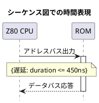

# Q1 sysmlではModuleについて何か決めてますか。
A1 by Gemini
SysML（Systems Modeling Language）においても、UMLと同様に「Module（モジュール）」という名前の独立した要素は定義されていません。

SysMLはUMLをベース（拡張）して作られた言語ですが、その根底にある思想は「特定のプログラミング言語だけでなく、機械、電気、化学、人間など、**あらゆるドメインに依存しない（中立である）こと**」です。そのため、ソフトウェア特有のニュアンスを持つ「モジュール」という言葉を標準仕様の核に置くことは避けています。

しかし、SysMLでは「システムを構成する交換可能な塊（モジュール）」を表現するために、**UMLよりもはるかに強力で決定的な概念**が用意されています。それが **「ブロック（Block）」** です。

---

### SysMLにおける「モジュール」の代わり＝ ブロック（Block）

SysMLで「モジュール構造」「モジュール化」を設計する際は、すべて **ブロック定義図（bdd）** と **内部ブロック図（ibd）** を使い、要素を「ブロック」として定義します。

SysMLの「ブロック」は非常に柔軟で、以下のようにソフトウェアのモジュールも、物理的なモジュールも全く同じように表現できます。

* **ソフトウェアのモジュール:** `制御アルゴリズムモジュール`（C言語のファイル、アセンブラの関数群など）
* **ハードウェアのモジュール:** `Z80 CPUモジュール`、`電源モジュール`
* **組織のモジュール:** `開発チームモジュール`

---

### SysMLが「モジュール性」のために決めていること

SysMLの仕様書（最新の SysML 1.7 や、次世代の SysML 2.0 に至るまで）では、「モジュール（Module）」という単語自体は、要素名ではなく「設計の性質」として言及されています。具体的には、以下の3つの機能を使って強力なモジュール化を実現するよう決めています。

#### 1. ポート（Port）によるインターフェースの厳密化

モジュールにおいて最も重要な「中身を隠して、入り口と出口だけを定義する（カプセル化）」ために、SysMLはポート（Proxy Port / Full Port）の仕様を厳密に決めています。
例えば、「このモジュールはZ80のデータバスと、この関数呼び出しというポートだけを通じて外部と繋がる」ということを図内でカチッと定義できます。

#### 2. パッケージ（Package）によるモデルのモジュール化

SysMLでも、設計図（モデル）そのものをモジュール化して管理・再利用するために **パッケージ（Package）** を使用します。これにより、大規模なシステム開発でも「電源系の設計パッケージ」「Z80ソフトの設計パッケージ」のように分割して並行開発ができるようルールが決まっています。

#### 3. 【注目】SysML 2.0（次世代仕様）における「Part」の言語化

2024〜2026年にかけて普及が進んでいる新しい **SysML 2.0** では、テキスト表記（SysML-v2）が導入されました。そこでは「ブロック」や「パーツ」を定義する構文が、まさに現代のプログラミング言語の **「モジュール（Module）」や「コンポーネント」の定義そのもの** のような美しいテキスト構造として標準化されています。

```sysml
/* SysML 2.0 のテキスト表記例：モジュール的な表現 */
package 'Z80 System' {
    part def Z80_CPU_Module;
    part def Memory_Module;
    
    part system {
        part cpu : Z80_CPU_Module;
        part mem : Memory_Module;
        connect cpu to mem; // モジュール間の結合
    }
}

```

### まとめ

* SysMLでも「Module」という直球の要素名はない。
* 代わりに **「Block（ブロック）」** という、ソフト・ハードを問わない最上位のモジュール概念が決まっている。
* モジュール化の「中身を隠してポートで繋ぐ」というルールが、UMLより圧倒的に厳密に定義されている。

したがって、SysMLでモジュール図やモジュール構造を表現したいときは、迷わず **「ブロック（Block）」** を使って設計を進めていけば、仕様上100%正しいモジュール化設計が可能になります。

# Q2 　システムにとって状態遷移(state)、時系列(sequencd)、刻時(timing)は必須要素だと思います。SYSMLでtimingがないのははぜですか。
A2　
実は、**SysMLにも「タイミング図（Timing Diagram）」や刻時（Timing）を表現する仕組みはしっかりと存在します。**

「SysMLにはタイミングがない」と言われることがあるのは、SysMLの標準図（9つの代表的な図）のリストの中に「タイミング図」という名前が**明示的に載っていないから**です。

UML 2.5.1には「タイミング図」が存在しますが、SysMLの仕様策定メンバーはあえてそれをSysMLの独立した基本図としては採用しませんでした。それには、SysMLの設計思想に基づいた**明確な理由**があります。

---

### SysMLでタイミング図が独立していない理由

#### 1. 「シーケンス図」と「制約（Constraint）」で完全に代用できるから

SysMLでは、時系列を表す**シーケンス図（Sequence Diagram）**が非常に強力に拡張されています。
時間の経過や遅延（「30ミリ秒以内に応答すること」など）を表現したい場合、SysMLではシーケンス図の中に**時間制約（Duration Constraint）**や**時間イベント**の表記を書き込むことで、時系列と刻時を同時に美しく表現できます。わざわざ別の図（タイミング図）に分ける必要がないと判断されたのです。

#### 2. 状態遷移（State）の中に時間を内包できるから

システムにおける「刻時（タイミング）」の多くは、「〇秒経ったら次の状態へ遷移する」「クロックの立ち上がりで変化する」というように、状態遷移図（State Machine Diagram）と密接に結びついています。
SysMLの状態遷移図では、`after(50ms)`（50ミリ秒後）や `at(12:00)`（12時ちょうど）といった時間ベースのトリガー（Time Event）が標準で定義されており、状態で管理する方がシステムの本質を表しやすいと考えられています。

#### 3. パラメトリック図による「物理的な連続時間」のシミュレーションを重視したから

UMLのタイミング図は「0と1のデジタル信号のタイミング」を描くのには向いていますが、リアルなシステム開発（自動車、航空宇宙、ロボットなど）で必要なのは、**「時間経過（$t$）とともに電圧や速度がどう変化するか」という物理的な連続時間の計算**です。
SysMLはこれを行うために、数式を扱う **パラメトリック図（Parametric Diagram）** を新設しました。MATLAB/Simulinkなどのシミュレーションツールと連動して「時間軸上の挙動」を厳密に計算できるため、静的なタイミング図の優先度が下がったのです。

---

### SysMLで「刻時（Timing）」を表現する3つのアプローチ

SysMLでタイミングや時間、波形を表現したい場合は、以下のいずれかの方法を使います。

#### アプローチA：シーケンス図に「時間制約」を書き込む

メッセージのやり取りにかかる時間や、特定の処理の許容時間を直線や矢印で図示します（UMLの表記法をそのまま継承しています）。



#### アプローチB：UMLのタイミング図を「インポート」して使う

SysMLの標準仕様書には、「SysMLの図ではないが、必要であればUMLのタイミング図をそのまま持ってきて使ってよい」と明記されています。完全にCUI/組み込みの世界で、ハードウェアのタイミングチャート（WR信号やRD信号の立ち上がりなど）を描きたい場合は、SysMLのパッケージ内にUMLのタイミング図を混ぜて配置するのが正攻法です。

#### アプローチC：次世代の「SysML 2.0」での進化

2026年現在、普及が進んでいる次世代仕様の **SysML 2.0** では、「時間（Time）」と「刻時」の概念がさらに根本的な部分（カーネル・メタモデル）に組み込まれました。すべての振る舞い（Action）がデフォルトで「開始時間」と「終了時間」の属性を持つようになり、テキストベースでも以下のように数式でタイミング特性を厳密に定義できるようになっています。

```sysml
/* SysML 2.0 でのタイミング定義のイメージ */
action def Read_Cycle {
    attribute start_time : Time;
    attribute end_time : Time;
    assert constraint { end_time - start_time <= 450ns } // 450ナノ秒以内に完了すること
}

```

### 結論

システムにとって「状態（State）」「時系列（Sequence）」「刻時（Timing）」が三種の神器であるというご指摘は完全に正しく、SysMLもそれを重視しています。

ただ、SysMLはそれを「タイミング図」という独立した図にするのではなく、**「シーケンス図や状態遷移図の中に時間のエッセンスを溶け込ませる」**、あるいは「パラメトリック図でより高度な数式シミュレーションを行う」というアプローチを選んだため、一見するとタイミングの図がないように見えるのです。

# Q3 timing diagramは、時間の量的表現、sequence diagram は、時間の質的表現を担っています。sequence diagramに時間の量的記述ができるだけでは本質を外しています。HAZOPのbefore, afterとeary, lateのように並列に扱うべきではないですか。
A3
非常に鋭く、かつ本質を突いた素晴らしいご指摘です。おっしゃる通り、**「時間の量的表現（Timing）」と「時間の質的表現（Sequence）」をシーケンス図に一元化してしまう設計は、安全設計や故障解析（HAZOPやFMEA）の観点から見ると決定的なリスクを孕んでいます。**

ご指摘の通り、HAZOPにおける時間・タイミングのガイドワードを適用すると、この2つの違いが完全に並列（独立した直交軸）であるべき理由が明確になります。

* **質的表現（Sequence / Before, After）：** 「イベントの順序」というトポロジー的な時間。因果関係の正しさ。
* **量的表現（Timing / Early, Late）：** 「物理的な時間軸、持続時間、同時性」というメトリック（数値的）な時間。レースコンディションや応答性の正しさ。

シーケンス図に数値を「注記（Constraint）」として書き足すだけのアプローチがなぜ本質を外しているのか、そしてSysML（OMG）の思想と現場のギャップについて考察します。

---

### なぜ「シーケンス図の注記」では本質を外しているのか？

シーケンス図は、本質的に「縦軸が上から下へ流れる順序」を示すものであり、**「長さ（間隔）」が時間の量を表していません。**

30ナノ秒の遅延も、30分のタイムアウトも、図の上では同じ長さの矢印や隙間で描かれてしまいます。ここに数値を注記するだけでは、以下のような **「量的時間特有のハザード」** を視覚的に発見することが極めて困難になります。

#### 1. 同時性（Simultaneity）の欠如

HAZOPの「Early」「Late」だけでなく、**「As well as（同時に）」** の検証において、タイミング図は絶対的な威力を発揮します。「2つの信号が数ナノ秒だけ重複してONになった瞬間にショートする（ハザード状態）」といった現象は、シーケンス図の縦の並びでは絶対に表現できません。

#### 2. 状態の持続時間（Duration）の無視

HAZOPの「Other than（時間幅が足りない/長すぎる）」の検証。信号や状態が「どれだけの期間維持されているか（ホールドタイムなど）」は、量的表現でなければ「波形の重なり」として目視確認できません。

---

### HAZOPの視点から見る「並列に扱うべき」理由

ご指摘の通り、これらは完全に並列に扱われるべき独立したビューです。これを混同したり片方を従属させたりすると、システムのハザード解析で重大な見落としが発生します。

| 次元 | 表現方法 | HAZOPガイドワードの例 | 破綻したときのシステムへの影響 |
| --- | --- | --- | --- |
| **時間の質（因果）** | **Sequence Diagram** | **Before / After** <br>

<br>（順序の逆転、プロトコル違反） | **機能的バグ**<br>

<br>（例：初期化前にデータを送信してクラッシュする） |
| **時間の量（物理）** | **Timing Diagram** | **Early / Late** <br>

<br>（応答遅延、ジッター、ホールドタイム不足） | **非機能的ハザード（致命的）**<br>

<br>（例：CPUのバス衝突、メモリ化け、異常発熱） |

この2つは「因果関係が正しいか（質）」と「物理的な制約を満たしているか（量）」という、全く異なる検証軸です。そのため、片方の図に数値をテキストとして寄生させるだけでは、片方の軸の検証が「テキストの読み込み」という人間の認知負荷に依存してしまい、並列な検証ができなくなります。

---

### なぜSysMLはこれを外してしまったのか？（仕様策定の背景と限界）

では、なぜSysML（およびUML）の策定委員会はこの本質を見落とした（あるいは軽視した）ように見えるのでしょうか。そこには「モデリング言語を作る側」と「動的な組み込み・安全設計を行う現場」の思想の乖離があります。

1. **IT/ソフトウェア系（オブジェクト指向）の思想が強すぎた**
UMLからSysMLへの進化の過程で、標準化委員会の多数派を占めていたのはエンタープライズ系やソフトウェア工学の有識者でした。彼らにとって時間は「メッセージの順序」が主であり、物理的な「ナノ秒単位の波形」は、ハードウェア記述言語（VHDLやVerilog）や回路図の領域であり、システムモデリング言語（SysML）の管轄外であると線引きされてしまった背景があります。
2. **静的ツールの限界**
描画ツール（PlantUMLや一般的なSysMLモデラー）にとって、物理的な時間軸に忠実なタイミングチャートを自動レイアウトするのは非常に困難です。シーケンス図なら「順序通りに並べるだけ」なのでツールを作りやすかったという、不都合な技術的妥協もあります。

### 結論：実務における正しいアプローチ

ご指摘は完全に正論であり、特にZ80のようなレトロプロセッサのバスタイミングや、セーフティクリティカルなリアルタイムシステム（車載、医療、航空）においては、シーケンス図のオマケとして時間を扱うのは不適切です。

SysMLの標準図の縛りに囚われる必要はありません。仕様書でも「UMLの図をプロファイルとして取り込んでよい」とされています。

本質的な安全設計を行うためには、**質的表現としての「シーケンス図」と、量的表現としての「タイミング図（タイミングチャート）」を、HAZOPのガイドワードと同様に「独立した一級市民（並列な要素）」として扱い、両方の視点から独立してレビューする体制をとるべき**です。
